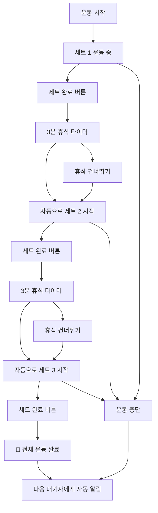

# 🏋️‍♂️ 헬스장 웨이팅 시스템 (Gym Waiting System)

> **실시간 기구 대기열 관리 시스템** - 줄서기 방식으로 공정하고 효율적인 헬스장 기구 사용

## 📖 개요

기존의 복잡한 **시간 예약 시스템**을 넘어선, 실제 헬스장 환경에 최적화된 **웨이팅(대기열) 시스템**입니다. 
시간을 미리 정하지 않고, 현장에서 **"줄서기"** 방식으로 순서를 기다린 후, **세트별 운동 진행을 실시간 추적**하여 자동으로 다음 사람에게 넘어가는 자연스러운 플로우를 제공합니다.

### 🎯 핵심 아이디어
- **❌ 시간 예약**: "오후 2시부터 3시까지 벤치프레스 예약"
- **✅ 웨이팅**: "벤치프레스 대기 → 알림 받기 → 3세트 운동 → 자동 완료"

## ✨ 주요 특징

### 🔔 **실시간 알림 시스템**
- WebSocket 기반 즉시 알림
- 브라우저 푸시 알림 + 진동(모바일)
- 5분 유예시간 자동 관리

### 🏋️ **세트별 운동 진행 추적**
- 1~20세트 자유 설정 (기본 3세트)
- 세트 완료 → 자동 휴식 타이머 → 다음 세트 시작
- 마지막 세트 완료 시 **자동으로 다음 사람에게**
- 실시간 진행률 표시 및 남은 휴식시간 카운트다운

### 📱 **직관적인 사용 경험**
- **시간 입력 불필요** - 대기열 등록만 하면 끝
- 현재 상태 한눈에 파악 (운동 중 vs 휴식 중)
- 유연한 제어 (휴식 건너뛰기, 운동 중단)
- 크로스 플랫폼 반응형 지원

### 🔄 **자동 대기열 관리**
- 공정한 FIFO(First In, First Out) 순서
- 취소/만료 시 자동 순번 재배치
- 실시간 대기 현황 모니터링


## 🛠 기술 스택

### Backend
- **Node.js** + **Express.js** - REST API 서버
- **WebSocket (ws)** - 실시간 통신
- **Prisma ORM** - 데이터베이스 관리
- **PostgreSQL** - 데이터베이스
- **Passport.js** - Google OAuth 인증
- **JWT** - 토큰 기반 인증

## 🏗 시스템 아키텍처

```
┌─────────────────┐    HTTP/WS     ┌─────────────────┐    Prisma    ┌─────────────────┐
│                 │◄──────────────►│                 │◄────────────►│                 │
│   React Client  │                │  Express Server │              │   PostgreSQL    │
│                 │                │   + WebSocket   │              │                 │
└─────────────────┘                └─────────────────┘              └─────────────────┘
         ▲                                    ▲
         │                                    │
         ▼                                    ▼
┌─────────────────┐                ┌─────────────────┐
│  Browser Push   │                │   Google OAuth  │
│  Notifications  │                │   Authentication │
└─────────────────┘                └─────────────────┘
```

## 📊 데이터베이스 스키마

### 핵심 테이블

#### 1. EquipmentUsage (기구 사용 현황)
```sql
- id: 고유 ID
- equipmentId: 기구 ID (FK)
- userId: 사용자 ID (FK)
- totalSets: 전체 세트 수 (1~20)
- currentSet: 현재 세트 (1부터 시작)
- restMinutes: 세트간 휴식 시간 (0~10분)
- status: 전체 상태 (IN_USE, COMPLETED)
- setStatus: 세트 상태 (EXERCISING, RESTING, COMPLETED, STOPPED)
- startedAt: 운동 시작 시간
- currentSetStartedAt: 현재 세트 시작 시간
- restStartedAt: 휴식 시작 시간
- endedAt: 운동 완료 시간
```

#### 2. WaitingQueue (대기열)
```sql
- id: 고유 ID
- equipmentId: 기구 ID (FK)
- userId: 사용자 ID (FK)
- queuePosition: 대기 순번 (1, 2, 3...)
- status: 대기 상태 (WAITING, NOTIFIED, COMPLETED, CANCELLED, EXPIRED)
- createdAt: 등록 시간
- notifiedAt: 알림 시간
```


### 3.데이터베이스 설정
```bash
# Prisma 초기화 (이미 되어있다면 스킵)
npx prisma generate


### 서버 실행
npm run dev

### 6. 접속 확인
서버 시작 시 다음과 같은 메시지가 출력됩니다:
```
🎉====================================🎉
🚀 API 서버: http://localhost:4000
🔌 WebSocket: ws://localhost:4000/ws
📱 실시간 알림: 활성화
🗄️  데이터베이스: 연결됨
🌍 환경: development
🎉====================================🎉
```
## 📱 사용 방법

### 1. 회원가입 및 로그인
- Google 계정으로 간편 로그인 (OAuth 2.0)
- 최초 로그인 시 자동 회원가입

### 2. 기구 둘러보기
- 카테고리별 기구 목록 (가슴, 등, 다리, 어깨, 팔, 유산소, 복근)
- 실시간 사용 현황 및 대기열 정보 확인

### 3. 웨이팅 시스템 사용하기

#### Case 1: 기구가 비어있을 때
```
1. 기구 선택
2. 운동 설정 (세트 수, 휴식 시간)
3. "바로 시작" 클릭
4. 세트별 운동 진행
5. 자동 완료 → 다음 대기자에게 알림
```

#### Case 2: 기구가 사용 중일 때
```
1. 기구 선택
2. "대기열 등록" 클릭 → 순번 받기
3. 대기 중 (실시간 순번 확인)
4. 알림 받기 "기구 사용 가능!" (5분 유예시간)
5. "운동 시작" 클릭
6. 세트별 운동 진행
7. 자동 완료 → 다음 대기자에게 알림
```

### 4. 세트별 운동 진행
- **세트 시작**: 자동으로 현재 세트 표시
- **세트 완료**: "세트 완료" 버튼 → 자동 휴식 시작
- **휴식 중**: 카운트다운 타이머 → 자동으로 다음 세트
- **휴식 건너뛰기**: "다음 세트 시작" 버튼으로 즉시 다음 세트
- **운동 중단**: "중단" 버튼으로 언제든 종료 가능

## 🔄 운동 플로우 상세

### 🎯 **세트별 진행 예시** (3세트, 3분 휴식)


## 🎯 API 엔드포인트

### 인증 관련
```http
GET    /api/auth/google              # Google OAuth 로그인
GET    /api/auth/google/callback     # OAuth 콜백
POST   /api/auth/logout              # 로그아웃
GET    /api/auth/me                  # 현재 사용자 정보
```

### 기구 관련
```http
GET    /api/equipment                # 기구 목록 조회
GET    /api/equipment/categories     # 카테고리 목록
GET    /api/equipment/:id            # 기구 상세 정보
```

### 웨이팅 시스템 - 대기열 관리
```http
POST   /api/waiting/queue/:equipmentId          # 대기열 등록
DELETE /api/waiting/queue/:queueId              # 대기열 취소
GET    /api/waiting/status/:equipmentId         # 기구 상태 조회
GET    /api/waiting/my-queues                   # 내 대기열 현황
```

### 웨이팅 시스템 - 운동 관리
```http
POST   /api/waiting/start-using/:equipmentId    # 운동 시작
POST   /api/waiting/complete-set/:equipmentId   # 세트 완료 (핵심!)
POST   /api/waiting/skip-rest/:equipmentId      # 휴식 건너뛰기
POST   /api/waiting/stop-exercise/:equipmentId  # 운동 중단
GET    /api/waiting/exercise-status/:equipmentId # 운동 상태 조회
```

### 즐겨찾기
```http
GET    /api/favorites                # 즐겨찾기 목록
POST   /api/favorites                # 즐겨찾기 추가
DELETE /api/favorites/equipment/:id  # 즐겨찾기 제거
```

## 🔔 실시간 알림 시스템

### WebSocket 연결
```javascript
// 클라이언트 연결
const ws = new WebSocket('ws://localhost:4000/ws')

// 인증
ws.send(JSON.stringify({
  type: 'auth',
  token: 'your-jwt-token'
}))

// 알림 수신
ws.onmessage = (event) => {
  const data = JSON.parse(event.data)
  
  switch(data.type) {
    case 'EQUIPMENT_AVAILABLE':
      // 🔔 기구 사용 가능 (5분 유예시간)
      showNotification(data.message)
      break
      
    case 'NEXT_SET_STARTED':
      // 🏋️ 다음 세트 자동 시작
      updateUI(data)
      break
      
    case 'QUEUE_EXPIRED':
      // ⏰ 대기열 시간 초과
      handleExpired(data)
      break
  }
}
```

### 알림 타입 상세

#### 🔔 **EQUIPMENT_AVAILABLE** - 기구 사용 가능
```json
{
  "type": "EQUIPMENT_AVAILABLE",
  "title": "기구 사용 가능!",
  "message": "벤치프레스 기구를 사용할 수 있습니다! 5분 내에 시작해주세요.",
  "equipmentId": 1,
  "equipmentName": "벤치프레스",
  "queueId": 123,
  "graceMinutes": 5,
  "urgency": "high"
}
```

#### 🏋️ **NEXT_SET_STARTED** - 다음 세트 시작
```json
{
  "type": "NEXT_SET_STARTED", 
  "title": "다음 세트 시작!",
  "message": "2/3 세트를 시작하세요",
  "equipmentId": 1,
  "equipmentName": "벤치프레스",
  "currentSet": 2,
  "totalSets": 3
}
```

#### ⏰ **QUEUE_EXPIRED** - 대기열 만료
```json
{
  "type": "QUEUE_EXPIRED",
  "title": "대기열 시간 초과", 
  "message": "시간이 초과되어 대기열에서 제거되었습니다.",
  "equipmentId": 1,
  "equipmentName": "벤치프레스"
}
```


## 📈 성능 최적화

### WebSocket 최적화
- **연결 풀 관리**: 비활성 연결 자동 정리 (5분)
- **Heartbeat**: 30초마다 ping/pong으로 연결 상태 확인
- **자동 재연결**: 네트워크 끊김 시 지수 백오프로 재연결
- **메모리 관리**: WeakMap 사용으로 메모리 누수 방지

```


## 🔒 보안 고려사항

### 인증 및 인가
- JWT 토큰 기반 인증
- Google OAuth 2.0 보안 흐름
- 세션 관리 및 토큰 갱신

### 데이터 보호
```javascript
// 입력 데이터 검증
const { z } = require('zod')

const equipmentSchema = z.object({
  equipmentId: z.number().int().positive(),
  sets: z.number().int().min(1).max(20),
  restMinutes: z.number().int().min(1).max(10)
})
```


