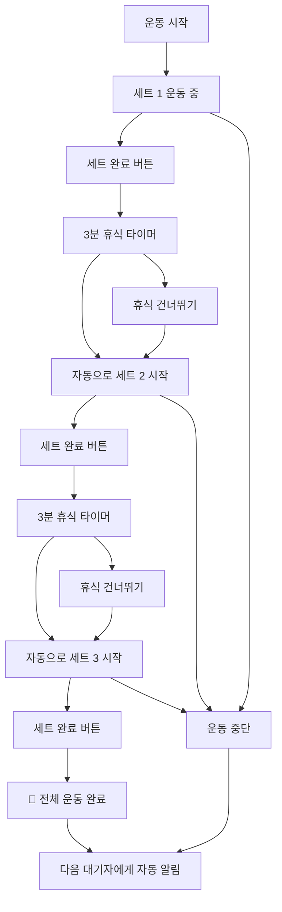

# 🏋️‍♂️ 헬스장 웨이팅 시스템 (Gym Waiting System)

> **실시간 기구 대기열 관리 시스템** - 줄서기 방식으로 공정하고 효율적인 헬스장 기구 사용

## 📖 개요

기존의 복잡한 **시간 예약 시스템**을 넘어선, 실제 헬스장 환경에 최적화된 **웨이팅(대기열) 시스템**입니다. 
시간을 미리 정하지 않고, 현장에서 **"줄서기"** 방식으로 순서를 기다린 후, **세트별 운동 진행을 실시간 추적**하여 자동으로 다음 사람에게 넘어가는 자연스러운 플로우를 제공합니다.

## 🏋️ 헬스장 기구 예약 및 웨이팅 시스템 - Backend API 문서
### 🔑 Auth API
- `GET /api/auth/google` - Google OAuth 로그인 시작
- `GET /api/auth/google/callback` - OAuth 콜백 처리
- `GET /api/auth/me` - 현재 사용자 정보 조회
- `POST /api/auth/logout` - 로그아웃

### 📋 Equipment API  
- `GET /api/equipment` - 기구 목록 조회 (카테고리/검색 필터 포함)
- `GET /api/equipment/search` - 기구 검색 (검색어로 필터링, 응답 형식은 기구 목록과 동일)
- `GET /api/equipment/categories` - 카테고리 목록
- `GET /api/equipment/:id` - 특정 기구 상세 조회
- `GET /api/equipment/status?equipmentIds=...` - 여러 기구들의 실시간 상태 정보 조회 (여러 기구의 사용/대기 현황 한번에 확인)
- `GET /api/equipment/my-completed` - 내가 오늘/지정일에 완료한 운동 목록 조회 (내 사용 이력)
- `GET /api/equipment/my-stats` - 나의 운동 통계 정보 조회 (주/월/년별 합계 및 분석)
- `POST /api/equipment/:id/quick-start` - 즉시 운동 시작 (해당 기구가 비어 있다면 바로 사용 시작)

### ⭐ Favorites API
- `GET /api/favorites` - 내 즐겨찾기 목록
- `POST /api/favorites` - 즐겨찾기 추가
- `DELETE /api/favorites/equipment/:equipmentId` - 즐겨찾기 제거
- `GET /api/favorites/check/:equipmentId` - 즐겨찾기 상태 확인

### 📅 Reservations API (기존 예약 시스템) => 제거할 항
- `POST /api/reservations` - 예약 생성
- `GET /api/reservations/me` - 내 예약 목록
- `GET /api/reservations/:id` - 특정 예약 상세 조회
- `PUT /api/reservations/:id` - 예약 수정
- `DELETE /api/reservations/:id` - 예약 삭제
- `GET /api/reservations/availability` - 예약 가능 시간 확인
- `GET /api/reservations/equipment/:equipmentId` - 특정 기구의 예약 현황 조회 (선택 날짜에 대한 일정, 공개)

### ⏰ 수정된 Waiting System API (웨이팅 시스템)
**🏋️ 운동 관리:**
- `POST /api/waiting/start-using/:equipmentId` - 기구 사용 시작
- `POST /api/waiting/complete-set/:equipmentId` - 세트 완료
- `POST /api/waiting/skip-rest/:equipmentId` - 휴식 스킵
- `POST /api/waiting/stop-exercise/:equipmentId` - 운동 중단

**📝 대기열 관리:**
- `POST /api/waiting/queue/:equipmentId` - 대기열 등록(해당 기구에 대기 시작)
- `DELETE /api/waiting/queue/:queueId` - 대기열 취소(현재 서버 미구현)
- `GET /api/waiting/status/:equipmentId` - 기구 상태 및 대기열 조회
- `POST /api/waiting/update-eta/:equipmentId` - (수동) 예상 대기시간 업데이트 + 브로드캐스트

**🔧 관리자 기능:**
- `GET /api/waiting/stats` - 사용 통계 조회

**📋 운동 루틴(루틴 API는 모두 JWT 인증 필요):**
- `GET /api/routines` - 내 운동 루틴 목록 조회(필요에 따라 활성/비활성 필터)
- `GET /api/routines/:id - 특정 루틴 상세 조회(포함된 운동 목록 등)
- `POST /api/routines/:id` - 새로운 운동 루틴 생성 (이름, 구성, 활성 여부 변경)
- `PUT /api/routines/:id` - 운동 루틴 수정(이름, 구성, 활성여부 변경)
- `DELETE /api/routines/:id` - 운동 루틴 삭제
- `POST /api/routines/:routineId/exercises/:exerciseId/start` - 루틴의 특정 운동 즉시 시작(기구 사용시작)
- `POST /api/routines/:routineId/exercises/:exerciseId/queue` - 루틴의 특정 운동 대기열 등록

## 🎯 시스템 개요

이 시스템은 헬스장의 기구 사용을 효율적으로 관리하기 위한 백엔드 API입니다. 주요 기능은 다음과 같습니다:

- **Google OAuth 인증**: 간편한 소셜 로그인
- **기구 관리**: 카테고리별 헬스장 기구 조회
- **예약 시스템**: 시간 기반 기구 예약
- **웨이팅 시스템**: 실시간 대기열 관리 및 세트별 운동 추적
- **즐겨찾기**: 자주 사용하는 기구 저장
- **실시간 알림**: WebSocket을 통한 즉시 알림

## 🔐 인증 (Authentication)

### Headers
```
Authorization: Bearer <JWT_TOKEN>
```

---

## 📋 Equipment API

### GET `/api/equipment`
기구 목록 조회 (인증 선택)
- **Query Parameters:**
  - `category` (optional): 카테고리 필터 ('가슴', '등', '다리', '어깨', '팔', '유산소' 등)
  - `search` (optional): 검색어
- **Request Body:** 없음

### GET `/api/equipment/categories`
카테고리 목록 조회
- **Request Body:** 없음

### GET `/api/equipment/:id`
특정 기구 상세 조회 (인증 선택)
- **Request Body:** 없음

---

## ⭐ Favorites API

### GET `/api/favorites`
내 즐겨찾기 목록 조회 (인증 필요)
- **Request Body:** 없음

### POST `/api/favorites`
즐겨찾기 추가 (인증 필요)
```json
{
  "equipmentId": 1
}
```

### DELETE `/api/favorites/equipment/:equipmentId`
즐겨찾기 제거 (인증 필요)
- **Request Body:** 없음

### GET `/api/favorites/check/:equipmentId`
특정 기구 즐겨찾기 여부 확인 (인증 필요)
- **Request Body:** 없음

---

## 📅 Reservations API (기존 예약 시스템)

### POST `/api/reservations`
예약 생성 (인증 필요)
```json
{
  "equipmentId": 1,
  "startAt": "2025-09-22T10:00:00.000Z",
  "endAt": "2025-09-22T11:00:00.000Z",
  "sets": 3,
  "restMinutes": 3
}
```

### GET `/api/reservations/me`
내 예약 목록 (인증 필요)
- **Request Body:** 없음

### GET `/api/reservations/all`
전체 예약 목록 - 관리자용 (인증 필요)
- **Request Body:** 없음

### GET `/api/reservations/:id`
단건 예약 조회 (인증 필요)
- **Request Body:** 없음

### PUT `/api/reservations/:id`
예약 수정 (인증 필요)
```json
{
  "equipmentId": 1,
  "startAt": "2025-09-22T10:00:00.000Z",
  "endAt": "2025-09-22T11:00:00.000Z",
  "sets": 4,
  "restMinutes": 2
}
```
*모든 필드 선택적*

### DELETE `/api/reservations/:id`
예약 삭제 (인증 필요)
- **Request Body:** 없음

### GET `/api/reservations/availability`
예약 가능 시간 확인
- **Query Parameters:**
  - `equipmentId`: 기구 ID (필수)
  - `date`: 날짜 YYYY-MM-DD (필수)
  - `open`: 운영 시작시간 (기본: 09:00)
  - `close`: 운영 종료시간 (기본: 18:00)
  - `slotMinutes`: 슬롯 간격(분) (기본: 30)
- **Request Body:** 없음

### GET `/api/reservations/equipment/:equipmentId`
특정 기구의 예약 현황 조회
- **Query Parameters:**
  - `date`: 날짜 YYYY-MM-DD (기본: 오늘)
- **Request Body:** 없음

---

## 수정된⏰ Waiting System API (웨이팅 시스템)

### 🏋️ 운동 관리

#### POST `/api/waiting/start-using/:equipmentId`
기구 사용 시작 (인증 필요)
```json
{
  "totalSets": 3,
  "restMinutes": 3
}
```

#### POST `/api/waiting/complete-set/:equipmentId`
세트 완료 (인증 필요)
- **Request Body:** 없음

#### POST `/api/waiting/skip-rest/:equipmentId`
휴식 스킵 (인증 필요)
- **Request Body:** 없음

#### POST `/api/waiting/stop-exercise/:equipmentId`
운동 중단 (인증 필요)
- **Request Body:** 없음

#### GET `/api/waiting/exercise-status/:equipmentId`
운동 상태 조회 (인증 필요)
- **Request Body:** 없음

### 📝 대기열 관리

#### POST `/api/waiting/queue/:equipmentId`
대기열 등록 (인증 필요)
- **Request Body:** 없음

#### DELETE `/api/waiting/queue/:queueId`
대기열 취소 (인증 필요)
- **Request Body:** 없음

#### GET `/api/waiting/status/:equipmentId`
기구 상태 및 대기열 조회 (공개)
- **Request Body:** 없음

### 🔧 관리자 기능

#### POST `/api/waiting/reorder/:equipmentId`
대기열 재정렬 (인증 필요)
- **Request Body:** 없음

#### POST `/api/waiting/force-complete/:equipmentId`
강제 완료 처리 (인증 필요)
- **Request Body:** 없음

#### GET `/api/waiting/stats`
사용 통계 조회 (인증 필요)
- **Request Body:** 없음

#### POST `/api/waiting/cleanup`
만료된 데이터 정리 (인증 필요)
- **Request Body:** 없음

---

## 🔑 Auth API

### GET `/api/auth/google`
Google OAuth 로그인 시작
- **Request Body:** 없음
- **Response:** Google OAuth 페이지로 리다이렉트

### GET `/api/auth/google/callback`
Google OAuth 콜백 (자동 처리)
- **Request Body:** 없음

### POST `/api/auth/logout`
로그아웃 (인증 필요)
- **Request Body:** 없음

### GET `/api/auth/me`
현재 사용자 정보 조회 (인증 필요)
- **Request Body:** 없음

---

## 🌐 WebSocket API

### WebSocket 연결
```
ws://localhost:4000/ws
```

### 인증 메시지
```json
{
  "type": "auth",
  "token": "<JWT_TOKEN>"
}
```

### 수신 알림 타입
- `EQUIPMENT_AVAILABLE`: 기구 사용 가능
- `REST_STARTED`: 휴식 시작
- `NEXT_SET_STARTED`: 다음 세트 시작
- `EXERCISE_STOPPED`: 운동 중단
- `QUEUE_CANCELLED`: 대기 취소
- `QUEUE_EXPIRED`: 대기 만료
- `FORCE_COMPLETED`: 관리자 강제 완료
- `SET_SKIPPED`: 휴식 스킵

---

## 📊 Response Format

### 성공 응답
```json
{
  "id": 1,
  "data": "..."
}
```

### 오류 응답
```json
{
  "error": "오류 메시지",
  "details": "상세 정보 (선택적)"
}
```

---


## 🔔 실시간 알림 (WebSocket)

### 연결 설정
```javascript
const ws = new WebSocket('wss://your-backend.com/ws');

ws.onopen = () => {
  // JWT 토큰으로 인증
  ws.send(JSON.stringify({
    type: 'auth',
    token: 'your-jwt-token'
  }));
};

ws.onmessage = (event) => {
  const data = JSON.parse(event.data);
  console.log('받은 알림:', data);
};
```

### 알림 타입들

#### 1. 인증 성공
```json
{
  "type": "auth_success",
  "message": "실시간 알림 연결 완료"
}
```

#### 2. 기구 사용 가능 알림
```json
{
  "type": "EQUIPMENT_AVAILABLE",
  "title": "기구 사용 가능",
  "message": "바벨 벤치 프레스을 사용할 차례입니다. 5분 내 시작해주세요",
  "equipmentId": 1,
  "equipmentName": "바벨 벤치 프레스",
  "queueId": 1,
  "graceMinutes": 5
}
```

#### 3. 휴식 시작 알림
```json
{
  "type": "REST_STARTED",
  "title": "휴식 시작",
  "message": "1/3 세트 완료. 2분 휴식",
  "equipmentId": 1
}
```

#### 4. 다음 세트 시작 알림
```json
{
  "type": "NEXT_SET_STARTED",
  "title": "다음 세트",
  "message": "2/3 세트 시작",
  "equipmentId": 1
}
```

#### 5. 대기 만료 알림
```json
{
  "type": "QUEUE_EXPIRED",
  "title": "대기 만료",
  "message": "시간 초과로 대기에서 제외되었습니다",
  "equipmentId": 1
}
```

## 🚨 에러 처리

모든 API는 다음 형식의 에러 응답을 반환합니다:

```json
{
  "error": "에러 메시지",
  "details": "상세 정보 (선택사항)"
}
```

### 주요 HTTP 상태 코드
- `200`: 성공
- `201`: 생성 성공
- `204`: 삭제 성공 (응답 바디 없음)
- `400`: 잘못된 요청 (입력 형식 오류)
- `401`: 인증 필요
- `403`: 권한 없음
- `404`: 리소스 없음
- `409`: 충돌 (중복 예약, 이미 사용 중 등)
- `500`: 서버 오류

## 💡 사용 팁

1. **토큰 관리**: JWT 토큰은 localStorage에 저장하고, 모든 인증이 필요한 API 호출 시 `Authorization: Bearer {token}` 헤더에 포함

2. **실시간 업데이트**: 웨이팅 시스템 관련 화면에서는 WebSocket 연결을 유지하여 실시간 알림 수신

3. **에러 처리**: 409 에러의 경우 사용자에게 명확한 안내 메시지 표시 (이미 사용 중, 대기 중 등)

4. **상태 폴링**: WebSocket이 연결되지 않은 상황에서는 `/api/waiting/status/{equipmentId}` 엔드포인트를 주기적으로 호출

5. **기구 상태 표시**: 각 기구의 현재 상태(사용 가능, 사용 중, 대기 인원)를 명확히 표시

## ✨ 주요 특징

### 🔔 **실시간 알림 시스템**
- WebSocket 기반 즉시 알림
- 브라우저 푸시 알림 + 진동(모바일)
- 5분 유예시간 자동 관리

### 🏋️ **세트별 운동 진행 추적**
- 1~20세트 자유 설정 (기본 3세트)
- 세트 완료 → 자동 휴식 타이머 → 다음 세트 시작
- 마지막 세트 완료 시 **자동으로 다음 사람에게**
- 실시간 진행률 표시 및 남은 휴식시간 카운트다운

### 📱 **직관적인 사용 경험**
- **시간 입력 불필요** - 대기열 등록만 하면 끝
- 현재 상태 한눈에 파악 (운동 중 vs 휴식 중)
- 유연한 제어 (휴식 건너뛰기, 운동 중단)
- 크로스 플랫폼 반응형 지원

### 🔄 **자동 대기열 관리**
- 공정한 FIFO(First In, First Out) 순서
- 취소/만료 시 자동 순번 재배치
- 실시간 대기 현황 모니터링


## 🛠 기술 스택

### Backend
- **Node.js** + **Express.js** - REST API 서버
- **WebSocket (ws)** - 실시간 통신
- **Prisma ORM** - 데이터베이스 관리
- **PostgreSQL** - 데이터베이스
- **Passport.js** - Google OAuth 인증
- **JWT** - 토큰 기반 인증


## 📱 사용 방법

### 1. 회원가입 및 로그인
- Google 계정으로 간편 로그인 (OAuth 2.0)
- 최초 로그인 시 자동 회원가입

### 2. 기구 둘러보기
- 카테고리별 기구 목록 (가슴, 등, 다리, 어깨, 팔, 유산소, 복근)
- 실시간 사용 현황 및 대기열 정보 확인

### 3. 웨이팅 시스템 사용하기

#### Case 1: 기구가 비어있을 때
```
1. 기구 선택
2. 운동 설정 (세트 수, 휴식 시간)
3. "바로 시작" 클릭
4. 세트별 운동 진행
5. 자동 완료 → 다음 대기자에게 알림
```

#### Case 2: 기구가 사용 중일 때
```
1. 기구 선택
2. "대기열 등록" 클릭 → 순번 받기
3. 대기 중 (실시간 순번 확인)
4. 알림 받기 "기구 사용 가능!" (5분 유예시간)
5. "운동 시작" 클릭
6. 세트별 운동 진행
7. 자동 완료 → 다음 대기자에게 알림
```

### 4. 세트별 운동 진행
- **세트 시작**: 자동으로 현재 세트 표시
- **세트 완료**: "세트 완료" 버튼 → 자동 휴식 시작
- **휴식 중**: 카운트다운 타이머 → 자동으로 다음 세트
- **휴식 건너뛰기**: "다음 세트 시작" 버튼으로 즉시 다음 세트
- **운동 중단**: "중단" 버튼으로 언제든 종료 가능

## 🔄 운동 플로우 상세

### 🎯 **세트별 진행 예시** (3세트, 3분 휴식)



