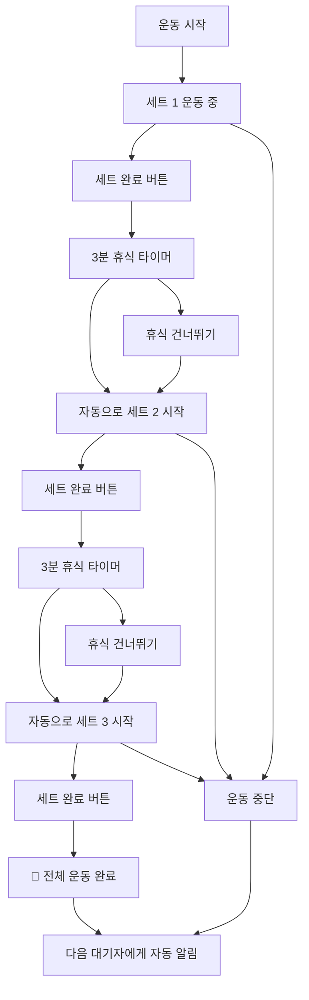

# 🏋️‍♂️ 헬스장 웨이팅 시스템 (Gym Waiting System)

> **실시간 기구 대기열 관리 시스템** - 줄서기 방식으로 공정하고 효율적인 헬스장 기구 사용

## 📖 개요

기존의 복잡한 **시간 예약 시스템**을 넘어선, 실제 헬스장 환경에 최적화된 **웨이팅(대기열) 시스템**입니다. 
시간을 미리 정하지 않고, 현장에서 **"줄서기"** 방식으로 순서를 기다린 후, **세트별 운동 진행을 실시간 추적**하여 자동으로 다음 사람에게 넘어가는 자연스러운 플로우를 제공합니다.

## 🎯 시스템 개요

이 시스템은 헬스장의 기구 사용을 효율적으로 관리하기 위한 백엔드 API입니다. 주요 기능은 다음과 같습니다:

- **Google OAuth 인증**: 간편한 소셜 로그인
- **기구 관리**: 카테고리별 헬스장 기구 조회
- **예약 시스템**: 시간 기반 기구 예약
- **웨이팅 시스템**: 실시간 대기열 관리 및 세트별 운동 추적
- **즐겨찾기**: 자주 사용하는 기구 저장
- **실시간 알림**: WebSocket을 통한 즉시 알림

## Backend API 문서
### 👉수정 혹은 추가된 API
-
### 🔑 Auth API
- `GET /api/auth/google` - Google OAuth 로그인 시작
- `GET /api/auth/google/callback` - OAuth 콜백 처리
- `GET /api/auth/me` - 현재 사용자 정보 조회
- `POST /api/auth/logout` - 로그아웃

### 📋 Equipment API  
- `GET /api/equipment` - 기구 목록 조회 (카테고리/검색 필터 포함)
- `GET /api/equipment/search` - 기구 검색 (검색어로 필터링, 응답 형식은 기구 목록과 동일)
- `GET /api/equipment/categories` - 카테고리 목록
- `GET /api/equipment/:id` - 특정 기구 상세 조회
- `GET /api/equipment/status?equipmentIds=...` - 여러 기구들의 실시간 상태 정보 조회 (여러 기구의 사용/대기 현황 한번에 확인)
- `GET /api/equipment/my-completed` - 내가 오늘/지정일에 완료한 운동 목록 조회 (내 사용 이력)
- `GET /api/equipment/my-stats` - 나의 운동 통계 정보 조회 (주/월/년별 합계 및 분석)
- `POST /api/equipment/:id/quick-start` - 즉시 운동 시작 (해당 기구가 비어 있다면 바로 사용 시작)

### ⭐ Favorites API
- `GET /api/favorites` - 내 즐겨찾기 목록
- `POST /api/favorites/:equipmentId` - 즐겨찾기 추가
- `DELETE /api/favorites/equipment/:equipmentId` - 즐겨찾기 제거
- `GET /api/favorites/check/:equipmentId` - 즐겨찾기 상태 확인(기구)


### ⏰ 수정된 Waiting System API (웨이팅 시스템)
**🏋️ 운동 관리:**
- `POST /api/waiting/start-using/:equipmentId` - 기구 사용 시작
- `POST /api/waiting/complete-set/:equipmentId` - 세트 완료
- `POST /api/waiting/skip-rest/:equipmentId` - 휴식 스킵
- `POST /api/waiting/stop-exercise/:equipmentId` - 운동 중단

**📝 대기열 관리:**
- `POST /api/waiting/queue/:equipmentId` - 대기열 등록(해당 기구에 대기 시작)
- `DELETE /api/waiting/queue/:queueId` - 대기열 취소
- `GET /api/waiting/status/:equipmentId` - 기구 상태 및 대기열 조회
- `POST /api/waiting/update-eta/:equipmentId` - (수동) 예상 대기시간 업데이트 + 브로드캐스트

**🔧 관리자 기능:**
- `GET /api/waiting/stats` - 사용 통계 조회

**📋 운동 루틴(루틴 API는 모두 JWT 인증 필요):**
- `GET /api/routines` - 내 운동 루틴 목록 조회(필요에 따라 활성/비활성 필터)
- `GET /api/routines/:id` - 특정 루틴 상세 조회(포함된 운동 목록 등)
- `POST /api/routines` - 새로운 운동 루틴 생성 (이름, 구성)
- `PUT /api/routines/:id` - 운동 루틴 수정(이름, 구성, 활성여부 변경)
- `DELETE /api/routines/:id` - 운동 루틴 삭제
- `POST /api/routines/:routineId/exercises/:exerciseId/start` - 루틴의 특정 운동 즉시 시작(기구 사용시작)
- `POST /api/routines/:routineId/exercises/:exerciseId/queue` - 루틴의 특정 운동 대기열 등록

# 📋 요청 바디, 응답 바디

## 1. 인증 (Auth) API

### 1.1 Google OAuth 로그인 시작
```
GET /api/auth/google
```
**요청바디**: 없음  
**응답바디**: 구글 OAuth 페이지로 리다이렉트

### 1.2 Google OAuth 콜백
```
GET /api/auth/google/callback
```
**요청바디**: 구글에서 제공하는 code 파라미터  
**응답바디**: 프론트엔드로 리다이렉트 (토큰과 사용자 정보 포함)

### 1.3 로그아웃
```
POST /api/auth/logout
```
**요청바디**: 없음  
**응답바디**:
```json
{
  "message": "로그아웃 성공"
}
```

### 1.4 현재 사용자 정보 조회
```
GET /api/auth/me
Authorization: Bearer <token>
```
**요청바디**: 없음  
**응답바디**:
```json
{
  "id": 1,
  "email": "user@example.com",
  "name": "사용자명",
  "avatar": "https://avatar-url.com",
  "createdAt": "2025-01-15T10:30:00.000Z"
}
```

## 2. 기구 (Equipment) API

### 2.1 기구 목록 조회
```
GET /api/equipment?category=all&search=&include_status=true
Authorization: Bearer <token> (선택사항)
```
**요청바디**: 없음  
**쿼리 파라미터**:
- `category`: 카테고리 필터 (기본값: all)
- `search`: 검색어
- `include_status`: 실시간 상태 포함 여부 (기본값: true)

**응답바디**:
```json
[
  {
    "id": 1,
    "name": "벤치프레스",
    "imageUrl": "https://image-url.com",
    "category": "가슴",
    "muscleGroup": "대흉근",
    "createdAt": "2025-01-15T10:30:00.000Z",
    "reservationCount": 5,
    "isFavorite": true,
    "status": {
      "isAvailable": false,
      "currentUser": "홍길동",
      "currentUserStartedAt": "2025-01-15T10:30:00.000Z",
      "currentUsageInfo": {
        "totalSets": 3,
        "currentSet": 2,
        "setStatus": "EXERCISING",
        "restSeconds": 180,
        "progress": 67,
        "estimatedEndAt": "2025-01-15T11:00:00.000Z"
      },
      "waitingCount": 2,
      "myQueuePosition": null,
      "myQueueStatus": null,
      "canStart": false,
      "canQueue": true,
      "completedToday": true,
      "lastCompletedAt": "2025-01-15T09:00:00.000Z",
      "lastCompletedSets": 3,
      "lastCompletedDuration": 15,
      "wasFullyCompleted": true
    }
  }
]
```

### 2.2 기구 검색
```
GET /api/equipment/search?q=벤치&category=가슴&available_only=false
Authorization: Bearer <token> (선택사항)
```
**요청바디**: 없음  
**쿼리 파라미터**:
- `q`: 검색어
- `category`: 카테고리 필터
- `available_only`: 사용 가능한 기구만 필터링

**응답바디**: 기구 목록 조회와 동일

### 2.3 카테고리 목록 조회
```
GET /api/equipment/categories
```
**요청바디**: 없음  
**응답바디**:
```json
[
  {
    "name": "가슴",
    "count": 5
  },
  {
    "name": "등",
    "count": 8
  }
]
```

### 2.4 기구 상태 조회
```
GET /api/equipment/status?equipmentIds=1,2,3
Authorization: Bearer <token> (선택사항)
```
**요청바디**: 없음  
**쿼리 파라미터**:
- `equipmentIds`: 쉼표로 구분된 기구 ID 목록

**응답바디**:
```json
{
  "1": {
    "isAvailable": true,
    "currentUser": null,
    "waitingCount": 0,
    "canStart": true,
    "canQueue": false
  },
  "2": {
    "isAvailable": false,
    "currentUser": "김철수",
    "waitingCount": 3,
    "canStart": false,
    "canQueue": true
  }
}
```

### 2.5 완료한 운동 목록 조회
```
GET /api/equipment/my-completed?date=2025-01-15&limit=20 // /api/equipment/my-completed만 해도 가능
Authorization: Bearer <token>
```
**요청바디**: 없음  
**쿼리 파라미터**:
- `date`: 특정 날짜 (YYYY-MM-DD)
- `limit`: 조회 개수 제한

**응답바디**:
```json
[
  {
    "id": 1,
    "equipmentId": 1,
    "equipment": {
      "id": 1,
      "name": "벤치프레스",
      "category": "가슴",
      "muscleGroup": "대흉근",
      "imageUrl": "https://image-url.com"
    },
    "startedAt": "2025-01-15T10:00:00.000Z",
    "endedAt": "2025-01-15T10:15:00.000Z",
    "totalSets": 3,
    "completedSets": 3,
    "restMinutes": 3,
    "setStatus": "COMPLETED",
    "duration": 15,
    "isFullyCompleted": true,
    "wasInterrupted": false
  }
]
```

### 2.6 운동 통계 조회
```
GET /api/equipment/my-stats?period=week
Authorization: Bearer <token>
```
**요청바디**: 없음  
**쿼리 파라미터**:
- `period`: today, week, month, year

**응답바디**:
```json
{
  "period": "week",
  "totalWorkouts": 12,
  "totalSets": 45,
  "totalMinutes": 180,
  "averageSetsPerWorkout": 4,
  "equipmentStats": [
    {
      "equipment": {
        "id": 1,
        "name": "벤치프레스",
        "category": "가슴"
      },
      "count": 3,
      "totalSets": 9,
      "totalMinutes": 45,
      "lastUsed": "2025-01-15T10:00:00.000Z"
    }
  ],
  "categoryStats": [
    {
      "category": "가슴",
      "count": 5,
      "totalSets": 15
    }
  ],
  "recentWorkouts": []
}
```

### 2.7 기구 상세 조회
```
GET /api/equipment/:id
Authorization: Bearer <token> (선택사항)
```
**요청바디**: 없음  
**응답바디**:
```json
{
  "id": 1,
  "name": "벤치프레스",
  "imageUrl": "https://image-url.com",
  "category": "가슴",
  "muscleGroup": "대흉근",
  "createdAt": "2025-01-15T10:30:00.000Z",
  "reservations": [],
  "isFavorite": true,
  "favoriteCount": 15,
  "status": {
    "isAvailable": true,
    "currentUser": null,
    "waitingCount": 0,
    "canStart": true
  }
}
```

### 2.8 빠른 시작
```
POST /api/equipment/:id/quick-start
Authorization: Bearer <token>
```
**요청바디**:
```json
{
  "totalSets": 3,
  "restSeconds": 180
}
```
**응답바디**:
```json
{
  "message": "벤치프레스 사용을 시작했습니다",
  "equipmentName": "벤치프레스",
  "totalSets": 3,
  "restSeconds": 180,
  "usageId": 1
}
```

## 3. 즐겨찾기 (Favorites) API

### 3.1 즐겨찾기 목록 조회
```
GET /api/favorites
Authorization: Bearer <token>
```
**요청바디**: 없음  
**응답바디**:
```json
[
  {
    "id": 1,
    "createdAt": "2025-01-15T10:30:00.000Z",
    "equipment": {
      "id": 1,
      "name": "벤치프레스",
      "imageUrl": "https://image-url.com",
      "category": "가슴",
      "muscleGroup": "대흉근",
      "reservationCount": 5,
      "isFavorite": true
    }
  }
]
```

### 3.2 즐겨찾기 추가
```
POST /api/favorites
Authorization: Bearer <token>
```
**요청바디**:
```json
{
  "equipmentId": 1
}
```
**응답바디**:
```json
{
  "id": 1,
  "createdAt": "2025-01-15T10:30:00.000Z",
  "equipment": {
    "id": 1,
    "name": "벤치프레스",
    "imageUrl": "https://image-url.com",
    "category": "가슴",
    "muscleGroup": "대흉근",
    "isFavorite": true
  }
}
```

### 3.3 즐겨찾기 제거
```
DELETE /api/favorites/equipment/:equipmentId
Authorization: Bearer <token>
```
**요청바디**: 없음  
**응답바디**: 204 No Content

### 3.4 즐겨찾기 상태 확인
```
GET /api/favorites/check/:equipmentId
Authorization: Bearer <token>
```
**요청바디**: 없음  
**응답바디**:
```json
{
  "isFavorite": true
}
```
## 4. 대기시스템 (Waiting) API

### 4.1 ETA 수동 업데이트
```
POST /api/waiting/update-eta/:equipmentId
Authorization: Bearer <token>
```
**요청바디**: 없음  
**응답바디**:
```json
{
  "equipmentId": 1,
  "equipmentName": "벤치프레스",
  "updatedAt": "2025-01-15T10:30:00.000Z",
  "updatedBy": 1,
  "currentUsage": {
    "userName": "홍길동",
    "totalSets": 3,
    "currentSet": 2,
    "setStatus": "EXERCISING",
    "estimatedMinutesLeft": 8,
    "progress": 67
  },
  "waitingQueue": [
    {
      "id": 1,
      "position": 1,
      "userName": "김철수",
      "estimatedWaitMinutes": 10,
      "isYou": false
    }
  ],
  "totalWaiting": 1,
  "isManualUpdate": true
}
```

### 4.2 기구 사용 시작
```
POST /api/waiting/start-using/:equipmentId
Authorization: Bearer <token>
```
**요청바디**:
```json
{
  "totalSets": 3,
  "restSeconds": 180
}
```
**응답바디**:
```json
{
  "id": 1,
  "equipmentId": 1,
  "equipmentName": "벤치프레스",
  "totalSets": 3,
  "currentSet": 1,
  "setStatus": "EXERCISING",
  "restSeconds": 180,
  "startedAt": "2025-01-15T10:30:00.000Z",
  "estimatedEndAt": "2025-01-15T11:00:00.000Z",
  "progress": 33
}
```

### 4.3 세트 완료
```
POST /api/waiting/complete-set/:equipmentId
Authorization: Bearer <token>
```
**요청바디**: 없음  
**응답바디**:
```json
{
  "message": "2/3 세트 완료",
  "setStatus": "RESTING",
  "restSeconds": 180
}
```

### 4.4 휴식 건너뛰기
```
POST /api/waiting/skip-rest/:equipmentId
Authorization: Bearer <token>
```
**요청바디**: 없음  
**응답바디**:
```json
{
  "message": "휴식을 건너뛰고 3/3 세트를 시작합니다",
  "currentSet": 3,
  "totalSets": 3,
  "setStatus": "EXERCISING",
  "skippedRest": true,
  "progress": 100
}
```

### 4.5 운동 중단
```
POST /api/waiting/stop-exercise/:equipmentId
Authorization: Bearer <token>
```
**요청바디**: 없음  
**응답바디**:
```json
{
  "message": "운동 중단 완료"
}
```

### 4.6 대기열 등록
```
POST /api/waiting/queue/:equipmentId
Authorization: Bearer <token>
```
**요청바디**: 없음  
**응답바디**:
```json
{
  "id": 1,
  "queuePosition": 2,
  "equipmentId": 1,
  "equipmentName": "벤치프레스",
  "status": "WAITING",
  "estimatedWaitMinutes": 15
}
```

### 4.7 실시간 상태 조회
```
GET /api/waiting/status/:equipmentId
```
**요청바디**: 없음  
**응답바디**:
```json
{
  "equipmentId": 1,
  "equipmentName": "벤치프레스",
  "isAvailable": false,
  "lastUpdated": "2025-01-15T10:30:00.000Z",
  "currentUser": {
    "name": "홍길동",
    "startedAt": "2025-01-15T10:00:00.000Z",
    "totalSets": 3,
    "currentSet": 2,
    "setStatus": "EXERCISING",
    "restSeconds": 180,
    "progress": 67,
    "setProgress": 45,
    "estimatedMinutesLeft": 8,
    "restTimeLeft": 0
  },
  "waitingQueue": [
    {
      "id": 1,
      "position": 1,
      "userName": "김철수",
      "status": "WAITING",
      "createdAt": "2025-01-15T10:25:00.000Z",
      "estimatedWaitMinutes": 10
    }
  ],
  "totalWaiting": 1,
  "averageWaitTime": 10
}
```

### 4.8 시스템 통계 (관리자용)
```
GET /api/waiting/admin/stats
Authorization: Bearer <token>
```
**요청바디**: 없음  
**응답바디**:
```json
{
  "activeUsages": 5,
  "activeQueues": 12,
  "autoUpdateCount": 3,
  "rateLimitedUsers": 2,
  "timestamp": "2025-01-15T10:30:00.000Z"
}
```

## 5. 루틴 (Routines) API

### 5.1 루틴 목록 조회
```
GET /api/routines?isActive=true
Authorization: Bearer <token>
```
**요청바디**: 없음  
**응답바디**:
```json
[
  {
    "id": 1,뀜
```
**요청바디**: 없음  
**응답바디**:
```json
{
  "equipmentId": 1,
  "equipmentName": "벤치프레스",
  "isAvailable": false,
  "lastUpdated": "2025-01-15T10:30:00.000Z",
  "currentUser": {
    "name": "홍길동",
    "startedAt": "2025-01-15T10:00:00.000Z",
    "totalSets": 3,
    "currentSet": 2,
    "setStatus": "EXERCISING",
    "restSeconds": 180,
    "progress": 67,
    "setProgress": 45,
    "estimatedMinutesLeft": 8,
    "restTimeLeft": 0
  },
  "waitingQueue": [
    {
      "id": 1,
      "position": 1,
      "userName": "김철수",
      "status": "WAITING",
      "createdAt": "2025-01-15T10:25:00.000Z",
      "estimatedWaitMinutes": 10
    }
  ],
  "totalWaiting": 1,
  "averageWaitTime": 10
}
```
## 🌐 WebSocket API

### WebSocket 연결
```
ws://localhost:4000/ws
```

### 인증 메시지
```json
{
  "type": "auth",
  "token": "<JWT_TOKEN>"
}
```

### 수신 알림 타입
- `EQUIPMENT_AVAILABLE`: 기구 사용 가능
- `REST_STARTED`: 휴식 시작
- `NEXT_SET_STARTED`: 다음 세트 시작
- `EXERCISE_STOPPED`: 운동 중단
- `QUEUE_CANCELLED`: 대기 취소
- `QUEUE_EXPIRED`: 대기 만료
- `FORCE_COMPLETED`: 관리자 강제 완료
- `SET_SKIPPED`: 휴식 스킵

---

## 📊 Response Format

### 성공 응답
```json
{
  "id": 1,
  "data": "..."
}
```

### 오류 응답
```json
{
  "error": "오류 메시지",
  "details": "상세 정보 (선택적)"
}
```

---


## 🔔 실시간 알림 (WebSocket)

### 연결 설정
```javascript
const ws = new WebSocket('wss://your-backend.com/ws');

ws.onopen = () => {
  // JWT 토큰으로 인증
  ws.send(JSON.stringify({
    type: 'auth',
    token: 'your-jwt-token'
  }));
};

ws.onmessage = (event) => {
  const data = JSON.parse(event.data);
  console.log('받은 알림:', data);
};
```

### 알림 타입들

#### 1. 인증 성공
```json
{
  "type": "auth_success",
  "message": "실시간 알림 연결 완료"
}
```

#### 2. 기구 사용 가능 알림
```json
{
  "type": "EQUIPMENT_AVAILABLE",
  "title": "기구 사용 가능",
  "message": "바벨 벤치 프레스을 사용할 차례입니다. 5분 내 시작해주세요",
  "equipmentId": 1,
  "equipmentName": "바벨 벤치 프레스",
  "queueId": 1,
  "graceMinutes": 5
}
```

#### 3. 휴식 시작 알림
```json
{
  "type": "REST_STARTED",
  "title": "휴식 시작",
  "message": "1/3 세트 완료. 2분 휴식",
  "equipmentId": 1
}
```

#### 4. 다음 세트 시작 알림
```json
{
  "type": "NEXT_SET_STARTED",
  "title": "다음 세트",
  "message": "2/3 세트 시작",
  "equipmentId": 1
}
```

#### 5. 대기 만료 알림
```json
{
  "type": "QUEUE_EXPIRED",
  "title": "대기 만료",
  "message": "시간 초과로 대기에서 제외되었습니다",
  "equipmentId": 1
}
```

## 🚨 에러 처리

모든 API는 다음 형식의 에러 응답을 반환합니다:

```json
{
  "error": "에러 메시지",
  "details": "상세 정보 (선택사항)"
}
```

### 주요 HTTP 상태 코드
- `200`: 성공
- `201`: 생성 성공
- `204`: 삭제 성공 (응답 바디 없음)
- `400`: 잘못된 요청 (입력 형식 오류)
- `401`: 인증 필요
- `403`: 권한 없음
- `404`: 리소스 없음
- `409`: 충돌 (중복 예약, 이미 사용 중 등)
- `500`: 서버 오류

## 💡 사용 팁

1. **토큰 관리**: JWT 토큰은 localStorage에 저장하고, 모든 인증이 필요한 API 호출 시 `Authorization: Bearer {token}` 헤더에 포함

2. **실시간 업데이트**: 웨이팅 시스템 관련 화면에서는 WebSocket 연결을 유지하여 실시간 알림 수신

3. **에러 처리**: 409 에러의 경우 사용자에게 명확한 안내 메시지 표시 (이미 사용 중, 대기 중 등)

4. **상태 폴링**: WebSocket이 연결되지 않은 상황에서는 `/api/waiting/status/{equipmentId}` 엔드포인트를 주기적으로 호출

5. **기구 상태 표시**: 각 기구의 현재 상태(사용 가능, 사용 중, 대기 인원)를 명확히 표시

## ✨ 주요 특징

### 🔔 **실시간 알림 시스템**
- WebSocket 기반 즉시 알림
- 브라우저 푸시 알림 + 진동(모바일)
- 5분 유예시간 자동 관리

### 🏋️ **세트별 운동 진행 추적**
- 1~20세트 자유 설정 (기본 3세트)
- 세트 완료 → 자동 휴식 타이머 → 다음 세트 시작
- 마지막 세트 완료 시 **자동으로 다음 사람에게**
- 실시간 진행률 표시 및 남은 휴식시간 카운트다운

### 📱 **직관적인 사용 경험**
- **시간 입력 불필요** - 대기열 등록만 하면 끝
- 현재 상태 한눈에 파악 (운동 중 vs 휴식 중)
- 유연한 제어 (휴식 건너뛰기, 운동 중단)
- 크로스 플랫폼 반응형 지원

### 🔄 **자동 대기열 관리**
- 공정한 FIFO(First In, First Out) 순서
- 취소/만료 시 자동 순번 재배치
- 실시간 대기 현황 모니터링


## 🛠 기술 스택

### Backend
- **Node.js** + **Express.js** - REST API 서버
- **WebSocket (ws)** - 실시간 통신
- **Prisma ORM** - 데이터베이스 관리
- **PostgreSQL** - 데이터베이스
- **Passport.js** - Google OAuth 인증
- **JWT** - 토큰 기반 인증


## 📱 사용 방법

### 1. 회원가입 및 로그인
- Google 계정으로 간편 로그인 (OAuth 2.0)
- 최초 로그인 시 자동 회원가입

### 2. 기구 둘러보기
- 카테고리별 기구 목록 (가슴, 등, 다리, 어깨, 팔, 유산소, 복근)
- 실시간 사용 현황 및 대기열 정보 확인

### 3. 웨이팅 시스템 사용하기

#### Case 1: 기구가 비어있을 때
```
1. 기구 선택
2. 운동 설정 (세트 수, 휴식 시간)
3. "바로 시작" 클릭
4. 세트별 운동 진행
5. 자동 완료 → 다음 대기자에게 알림
```

#### Case 2: 기구가 사용 중일 때
```
1. 기구 선택
2. "대기열 등록" 클릭 → 순번 받기
3. 대기 중 (실시간 순번 확인)
4. 알림 받기 "기구 사용 가능!" (5분 유예시간)
5. "운동 시작" 클릭
6. 세트별 운동 진행
7. 자동 완료 → 다음 대기자에게 알림
```

### 4. 세트별 운동 진행
- **세트 시작**: 자동으로 현재 세트 표시
- **세트 완료**: "세트 완료" 버튼 → 자동 휴식 시작
- **휴식 중**: 카운트다운 타이머 → 자동으로 다음 세트
- **휴식 건너뛰기**: "다음 세트 시작" 버튼으로 즉시 다음 세트
- **운동 중단**: "중단" 버튼으로 언제든 종료 가능

## 🔄 운동 플로우 상세

### 🎯 **세트별 진행 예시** (3세트, 3분 휴식)



