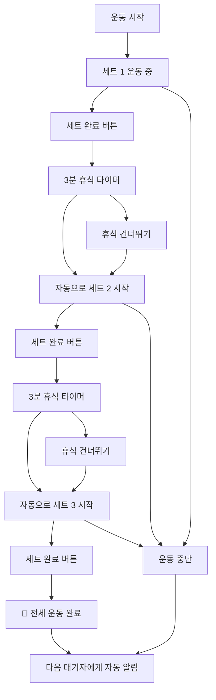

# 🏋️‍♂️ 헬스장 웨이팅 시스템 (Gym Waiting System)

> **실시간 기구 대기열 관리 시스템** - 줄서기 방식으로 공정하고 효율적인 헬스장 기구 사용

## 📖 개요

기존의 복잡한 **시간 예약 시스템**을 넘어선, 실제 헬스장 환경에 최적화된 **웨이팅(대기열) 시스템**입니다. 
시간을 미리 정하지 않고, 현장에서 **"줄서기"** 방식으로 순서를 기다린 후, **세트별 운동 진행을 실시간 추적**하여 자동으로 다음 사람에게 넘어가는 자연스러운 플로우를 제공합니다.

## 🎯 시스템 개요

이 시스템은 헬스장의 기구 사용을 효율적으로 관리하기 위한 백엔드 API입니다. 주요 기능은 다음과 같습니다:

- **Google OAuth 인증**: 간편한 소셜 로그인
- **기구 관리**: 카테고리별 헬스장 기구 조회
- **예약 시스템**: 시간 기반 기구 예약
- **웨이팅 시스템**: 실시간 대기열 관리 및 세트별 운동 추적
- **즐겨찾기**: 자주 사용하는 기구 저장
- **실시간 알림**: WebSocket을 통한 즉시 알림

## Backend API 문서
### 추가 API 1113
- **루틴에서의 대기 등록**
  - `POST /api/routines/:routineId/queue/:equipmentId` — 루틴에서 특정 운동 대기 등록
  - `POST /api/routines/:routineId/queue-next` — 루틴의 다음 운동 자동 대기 등록
  - `GET /api/routines/:routineId/queue-status` — 루틴 전체 운동의 대기 상태 조회
  
### 추가 API 1112
- **루틴 수정(멀티 수정)**
  - `PATCH /api/routines/:routineId` — 여러 운동을 한 번에 수정/추가, 순서(order)를 통해 변경 가능
  - `GET /api/equipment?include_status=true&sort_by=available` — 사용가능 우선 정렬 : status.isAvailable=true인 장비들이 위에, 같다면 waitingCount↑, 그래도 같으면 estimatedWaitMinutes↑ 순.
  - `GET /api/equipment?include_status=true&sort_by=waiting_asc` — 대기 인원 적은 -> 많은
  - `GET /api/equipment?include_status=true&sort_by=waiting_desc` — 대기 인원 많은 -> 적은
   - `GET /api/equipment?include_status=true&category=다리&search=스쿼트&sort_by=available` — 검색/카테고리 필터 조합

### 추가API 1108
- **루틴 수정(부분 변경) 전용 엔드포인트**
  - `PATCH /api/routines/:routineId/name` — 루틴 이름만 변경
  - `POST  /api/routines/:routineId/exercises/add` — 루틴에 기구 추가
  - `DELETE /api/routines/:routineId/exercises/:equipmentId` — 루틴에서 기구 제거
  - `PATCH /api/routines/:routineId/exercises/:equipmentId/sets` — 세트 수만 변경
  - `PATCH /api/routines/:routineId/exercises/:equipmentId/rest` — 휴식 시간만 변경
  - `PATCH /api/routines/:routineId/exercises/:equipmentId/order` — 순서만 변경
- **루틴 운동 시작**
  - `POST /api/routines/:routineId/start-first` — 첫 운동 자동 시작
  - `POST /api/routines/:routineId/start/:equipmentId` — 특정 기구부터 시작
  - `POST /api/routines/:routineId/next` - 루틴 상 다음 운동 시작
- **운동 진행 관리(사용자 기반, equipmentId 불필요)**
  - `POST /api/waiting/complete-set` — 현재 사용 중인 기구의 세트 완료
  - `POST /api/waiting/skip-rest` — 현재 사용 중인 기구의 휴식 스킵
  - `POST /api/waiting/stop-exercise` — 현재 운동 중단
 
### 추가API 1104
- 🆕 `GET /api/equipment/today-total-time` - 오늘 하루 총 운동시간 및 상세 분석

### 알람API
- `GET /api/notifications` - 알림목록조회
- `GET /api/notifications/unread-count` - 읽지 않은 알림 개수
- `PATCH /api/notifications/:id/read` - 특정 알림 읽음 처리
- `PATCH /api/notifications/read` - 여러 특정 알림 읽음 처리
- `PATCH /api/notifications/read-all` - 모든 알림 읽음 처리

### 🔑 Auth API
- `GET /api/auth/google` - Google OAuth 로그인 시작
- `GET /api/auth/google/callback` - OAuth 콜백 처리
- `GET /api/auth/me` - 현재 사용자 정보 조회
- `POST /api/auth/logout` - 로그아웃

### 📋 Equipment API  
- `GET /api/equipment` - 기구 목록 조회 (카테고리/검색 필터 포함)
- `GET /api/equipment/search` - 기구 검색 (검색어로 필터링, 응답 형식은 기구 목록과 동일)
- `GET /api/equipment/categories` - 카테고리 목록
- `GET /api/equipment/:id` - 특정 기구 상세 조회
- `GET /api/equipment/status?equipmentIds=...` - 여러 기구들의 실시간 상태 정보 조회 (여러 기구의 사용/대기 현황 한번에 확인)
- `GET /api/equipment/my-completed` - 내가 오늘/지정일에 완료한 운동 목록 조회 (내 사용 이력)
- `GET /api/equipment/my-stats` - 나의 운동 통계 정보 조회 (주/월/년별 합계 및 분석)
- 🆕 `GET /api/equipment/today-total-time` - 오늘 하루 총 운동시간 및 상세 분석
- `POST /api/equipment/:id/quick-start` - 즉시 운동 시작 (해당 기구가 비어 있다면 바로 사용 시작)

### ⭐ Favorites API
- `GET /api/favorites` - 내 즐겨찾기 목록
- `POST /api/favorites/:equipmentId` - 즐겨찾기 추가
- `DELETE /api/favorites/equipment/:equipmentId` - 즐겨찾기 제거
- `GET /api/favorites/check/:equipmentId` - 즐겨찾기 상태 확인(기구)


### ⏰ 수정된 Waiting System API (웨이팅 시스템)
**🏋️ 운동 관리:**
- `POST /api/waiting/start-using/:equipmentId` - 기구 사용 시작
- `POST /api/waiting/complete-set/:equipmentId` - 세트 완료
- `POST /api/waiting/skip-rest/:equipmentId` - 휴식 스킵
- `POST /api/waiting/stop-exercise/:equipmentId` - 운동 중단

**📝 대기열 관리:**
- `POST /api/waiting/queue/:equipmentId` - 대기열 등록(해당 기구에 대기 시작)
- `DELETE /api/waiting/queue/:queueId` - 대기열 취소
- `GET /api/waiting/status/:equipmentId` - 기구 상태 및 대기열 조회
- `POST /api/waiting/update-eta/:equipmentId` - (수동) 예상 대기시간 업데이트 + 브로드캐스트

**🔧 관리자 기능:**
- `GET /api/waiting/stats` - 사용 통계 조회

**📋 운동 루틴(루틴 API는 모두 JWT 인증 필요):**
- `GET /api/routines` - 내 운동 루틴 목록 조회(필요에 따라 활성/비활성 필터)
- `GET /api/routines/:id` - 특정 루틴 상세 조회(포함된 운동 목록 등)
- `POST /api/routines` - 새로운 운동 루틴 생성 (이름, 구성)
- `PUT /api/routines/:id` - 운동 루틴 수정(이름, 구성, 활성여부 변경)
- `DELETE /api/routines/:id` - 운동 루틴 삭제
- `POST /api/routines/:routineId/exercises/:exerciseId/start` - 루틴의 특정 운동 즉시 시작(기구 사용시작)
- `POST /api/routines/:routineId/exercises/:exerciseId/queue` - 루틴의 특정 운동 대기열 등록
- `PUT /api/routines/active-usage/rest-time` - 휴식타이머 +-10초 간격 조정
- `GET /api/routines/active-usage/status`- 현재 운동 상태 True/False

# 📋 요청 바디, 응답 바디
## 추가 API 1113
- **루틴에서의 대기 등록**
- 루틴 아이디 : 9
- 기존 루틴 기구 순서 : 17 -> 14 -> 12 -> 16 -> 18

  - `POST /api/routines/:routineId/queue/:equipmentId` — 루틴에서 특정 운동 대기 등록
 
  - 응답 바디 : 루틴 Id : 9, equipment_id : 12
  ```json
  {
      "message": "기본 루틴: 스미스 머신 대기열에 등록되었습니다",
      "routine": {
          "id": 9,
          "name": "기본 루틴"
      },
      "equipment": {
          "id": 12,
          "name": "스미스 머신",
          "category": "다리",
          "imageUrl": "https://yrejfssusnltxpnqquzi.supabase.co/storage/v1/object/public/equipment/machine-smith.png"
      },
      "queue": {
          "queueId": 8,
          "queuePosition": 1,
          "estimatedWaitMinutes": 0
      },
      "exerciseInfo": {
          "order": 3,
          "targetSets": 4,
          "targetReps": "8-12",
          "restSeconds": 180,
          "notes": "스미스 머신 - 무게 점진적으로 증가"
      }
  }
  ```

  - `POST /api/routines/:routineId/queue-next` — 루틴의 다음 운동 자동 대기 등록
  
  - 응답 바디 : 루틴에서 운동하고 있을시에만
  ```json
  {
    "message": "다음 운동: 케이블머신 대기열 등록",
    "routine": {
        "id": 9,
        "name": "기본 루틴"
    },
    "currentExercise": {
        "equipmentId": 17,
        "equipmentName": "레그컬",
        "order": 1
    },
    "nextExercise": {
        "equipmentId": 14,
        "equipmentName": "케이블머신",
        "order": 2,
        "targetSets": 3,
        "restSeconds": 180
    },
    "queue": {
        "queueId": 9,
        "queuePosition": 1,
        "estimatedWaitMinutes": 0
    }
  }
  ```

  - `GET /api/routines/:routineId/queue-status` — 루틴 전체 운동의 대기 상태 조회
 
  - 응답 바디
  ```json
  {
    "routineId": 9,
    "routineName": "기본 루틴",
    "isActive": true,
    "exercises": [
        {
            "exerciseId": 47,
            "order": 1,
            "equipment": {
                "id": 17,
                "name": "레그컬",
                "category": "다리",
                "imageUrl": "https://yrejfssusnltxpnqquzi.supabase.co/storage/v1/object/public/equipment/machine-legcurl.png"
            },
            "targetSets": 2,
            "restSeconds": 90,
            "status": {
                "isAvailable": false,
                "currentUser": "박수현",
                "waitingCount": 0,
                "myQueuePosition": null,
                "myQueueStatus": null,
                "myQueueId": null,
                "canQueue": true
            }
        },
        {
            "exerciseId": 48,
            "order": 2,
            "equipment": {
                "id": 14,
                "name": "케이블머신",
                "category": "어깨",
                "imageUrl": "https://yrejfssusnltxpnqquzi.supabase.co/storage/v1/object/public/equipment/machine-cable.png"
            },
            "targetSets": 3,
            "restSeconds": 180,
            "status": {
                "isAvailable": true,
                "currentUser": null,
                "waitingCount": 1,
                "myQueuePosition": 1,
                "myQueueStatus": "WAITING",
                "myQueueId": 9,
                "canQueue": false
            }
        },
        {
            "exerciseId": 45,
            "order": 3,
            "equipment": {
                "id": 12,
                "name": "스미스 머신",
                "category": "다리",
                "imageUrl": "https://yrejfssusnltxpnqquzi.supabase.co/storage/v1/object/public/equipment/machine-smith.png"
            },
            "targetSets": 4,
            "restSeconds": 180,
            "status": {
                "isAvailable": true,
                "currentUser": null,
                "waitingCount": 1,
                "myQueuePosition": 1,
                "myQueueStatus": "WAITING",
                "myQueueId": 8,
                "canQueue": false
            }
        },
        {
            "exerciseId": 46,
            "order": 4,
            "equipment": {
                "id": 16,
                "name": "레그프레스",
                "category": "다리",
                "imageUrl": "https://yrejfssusnltxpnqquzi.supabase.co/storage/v1/object/public/equipment/machine-legpress.png"
            },
            "targetSets": 3,
            "restSeconds": 120,
            "status": {
                "isAvailable": true,
                "currentUser": null,
                "waitingCount": 0,
                "myQueuePosition": null,
                "myQueueStatus": null,
                "myQueueId": null,
                "canQueue": false
            }
        },
        {
            "exerciseId": 52,
            "order": 5,
            "equipment": {
                "id": 18,
                "name": "풀업",
                "category": "등",
                "imageUrl": "https://yrejfssusnltxpnqquzi.supabase.co/storage/v1/object/public/equipment/machine-pullup.png"
            },
            "targetSets": 2,
            "restSeconds": 270,
            "status": {
                "isAvailable": true,
                "currentUser": null,
                "waitingCount": 0,
                "myQueuePosition": null,
                "myQueueStatus": null,
                "myQueueId": null,
                "canQueue": false
            }
        }
    ],
    "summary": {
        "totalExercises": 5,
        "availableCount": 4,
        "myQueuedCount": 2
    }
  }
  ```

## 추가 API 1112
-  `PATCH /api/routines/:routineId` - 루틴 수정(멀티 수정)
- 기존 루틴:
```json
 {
    "id": 10,
    "name": "기본 루틴",
    "isActive": false,
    "exerciseCount": 3,
    "exercises": [
        {
            "id": 49,
            "routineId": 10,
            "equipmentId": 12,
            "order": 1,
            "targetSets": 4,
            "targetReps": "8-12",
            "restSeconds": 180,
            "notes": "스미스 머신 - 무게 점진적으로 증가",
            "createdAt": "2025-11-12T04:43:41.958Z",
            "equipment": {
                "id": 12,
                "name": "스미스 머신",
                "imageUrl": "https://yrejfssusnltxpnqquzi.supabase.co/storage/v1/object/public/equipment/machine-smith.png",
                "category": "다리",
                "muscleGroup": "대퇴사두근, 둔근, 햄스트링, 내전근",
                "createdAt": "2025-09-29T06:43:19.261Z"
            }
        },
        {
            "id": 50,
            "routineId": 10,
            "equipmentId": 16,
            "order": 2,
            "targetSets": 3,
            "targetReps": "10-15",
            "restSeconds": 120,
            "notes": "레그프레스",
            "createdAt": "2025-11-12T04:43:41.958Z",
            "equipment": {
                "id": 16,
                "name": "레그프레스",
                "imageUrl": "https://yrejfssusnltxpnqquzi.supabase.co/storage/v1/object/public/equipment/machine-legpress.png",
                "category": "다리",
                "muscleGroup": "대퇴사두근, 둔근",
                "createdAt": "2025-09-29T06:43:19.360Z"
            }
        },
        {
            "id": 51,
            "routineId": 10,
            "equipmentId": 17,
            "order": 3,
            "targetSets": 3,
            "targetReps": "12-15",
            "restSeconds": 90,
            "notes": "레그컬 - 마지막 세트 드롭셋",
            "createdAt": "2025-11-12T04:43:41.958Z",
            "equipment": {
                "id": 17,
                "name": "레그컬",
                "imageUrl": "https://yrejfssusnltxpnqquzi.supabase.co/storage/v1/object/public/equipment/machine-legcurl.png",
                "category": "다리",
                "muscleGroup": "햄스트링",
                "createdAt": "2025-09-29T06:43:19.372Z"
            }
        }
    ],
    "createdAt": "2025-11-12T04:43:41.906Z",
    "updatedAt": "2025-11-12T04:43:41.906Z"
}
  ```
- 요청 바디
  ```json
  {
  "exercises": [
    {
      "equipmentId": 18,
      "targetSets": 2,
      "targetReps": "10",
      "restSeconds": 270,
      "notes": "스미스머신"
    },
    {
      "equipmentId": 17,
      "order": 1,
      "targetSets": 2
    }
     ]
  }

  ```
- 응답(예시)
  ```json
  {
    "message": "1개 운동 수정, 1개 운동 추가",
    "routine": {
        "id": 10,
        "userId": 1,
        "name": "기본 루틴",
        "isActive": false,
        "createdAt": "2025-11-12T04:43:41.906Z",
        "updatedAt": "2025-11-12T04:43:41.906Z",
        "exercises": [
            {
                "id": 51,
                "routineId": 10,
                "equipmentId": 17,
                "order": 1,
                "targetSets": 2,
                "targetReps": "12-15",
                "restSeconds": 90,
                "notes": "레그컬 - 마지막 세트 드롭셋",
                "createdAt": "2025-11-12T04:43:41.958Z",
                "equipment": {
                    "id": 17,
                    "name": "레그컬",
                    "imageUrl": "https://yrejfssusnltxpnqquzi.supabase.co/storage/v1/object/public/equipment/machine-legcurl.png",
                    "category": "다리",
                    "muscleGroup": "햄스트링",
                    "createdAt": "2025-09-29T06:43:19.372Z"
                }
            },
            {
                "id": 49,
                "routineId": 10,
                "equipmentId": 12,
                "order": 2,
                "targetSets": 4,
                "targetReps": "8-12",
                "restSeconds": 180,
                "notes": "스미스 머신 - 무게 점진적으로 증가",
                "createdAt": "2025-11-12T04:43:41.958Z",
                "equipment": {
                    "id": 12,
                    "name": "스미스 머신",
                    "imageUrl": "https://yrejfssusnltxpnqquzi.supabase.co/storage/v1/object/public/equipment/machine-smith.png",
                    "category": "다리",
                    "muscleGroup": "대퇴사두근, 둔근, 햄스트링, 내전근",
                    "createdAt": "2025-09-29T06:43:19.261Z"
                }
            },
            {
                "id": 50,
                "routineId": 10,
                "equipmentId": 16,
                "order": 3,
                "targetSets": 3,
                "targetReps": "10-15",
                "restSeconds": 120,
                "notes": "레그프레스",
                "createdAt": "2025-11-12T04:43:41.958Z",
                "equipment": {
                    "id": 16,
                    "name": "레그프레스",
                    "imageUrl": "https://yrejfssusnltxpnqquzi.supabase.co/storage/v1/object/public/equipment/machine-legpress.png",
                    "category": "다리",
                    "muscleGroup": "대퇴사두근, 둔근",
                    "createdAt": "2025-09-29T06:43:19.360Z"
                }
            },
            {
                "id": 53,
                "routineId": 10,
                "equipmentId": 18,
                "order": 4,
                "targetSets": 2,
                "targetReps": "10",
                "restSeconds": 270,
                "notes": "스미스머신",
                "createdAt": "2025-11-12T04:46:16.273Z",
                "equipment": {
                    "id": 18,
                    "name": "풀업",
                    "imageUrl": "https://yrejfssusnltxpnqquzi.supabase.co/storage/v1/object/public/equipment/machine-pullup.png",
                    "category": "등",
                    "muscleGroup": "광배근, 이두, 어깨",
                    "createdAt": "2025-09-29T06:43:19.391Z"
                }
            }
        ]
    }
  }
  
  ```

## 추가된 API 1108
### 1. **루틴 수정(부분 변경) 전용 엔드포인트**
  - `PATCH /api/routines/:routineId/name` — 루틴 이름만 변경
- 요청 바디
  ```json
  { "name": "강화된 하체 루틴" }
  ```
- 응답(예시)
  ```json
  { "message": "루틴 이름이 변경되었습니다", "id": 7, "name": "강화된 하체 루틴" }
  ```
  - `POST  /api/routines/:routineId/exercises/add` — 루틴에 기구 추가
  - 요청 바디
  ```json
  { "equipmentId": 10, "targetSets": 3, "restSeconds": 120, "notes": "폼 집중" }
  ```
- 응답(예시)
  ```json
  {
    "message": "기구가 추가되었습니다",
    "routineId": 7,
    "exercise": { "equipmentId": 10, "targetSets": 3, "restSeconds": 120, "order": 4, "notes": "폼 집중" }
  }
  ```

  - `DELETE /api/routines/:routineId/exercises/:equipmentId` — 루틴에서 기구 제거
  - 응답(예시) `{ "message": "기구가 삭제되었습니다", "routineId": 7, "equipmentId": 5 }`

  - `PATCH /api/routines/:routineId/exercises/:equipmentId/sets` — 세트 수만 변경
  - 요청 바디
  ```json
  { "targetSets": 5 }
  ```
- 응답(예시)
  ```json
  { "message": "세트 수가 변경되었습니다", "routineId": 7, "equipmentId": 1, "targetSets": 5 }
  ```

  - `PATCH /api/routines/:routineId/exercises/:equipmentId/rest` — 휴식 시간만 변경
  - 요청 바디
  ```json
  { "restSeconds": 90 }
  ```
- 응답(예시)
  ```json
  { "message": "휴식 시간이 변경되었습니다", "routineId": 7, "equipmentId": 1, "restSeconds": 90 }
  ```

  - `PATCH /api/routines/:routineId/exercises/:equipmentId/order` — 순서만 변경
  - 요청 바디
  ```json
  { "newOrder": 1 }
  ```
- 응답(예시)
  ```json
  { "message": "순서가 변경되었습니다", "routineId": 7, "equipmentId": 5, "order": 1 }

### 2. **루틴 운동 시작**
  - `POST /api/routines/:routineId/start-first` — 첫 운동 자동 시작
  - 요청 바디(예시)
  ```json
  { "totalSets": 3, "restSeconds": 180 }
  ```
- 성공 응답(예시)
  ```json
  {
    "message": "하체 루틴 시작: 스쿼트",
    "routineId": 7,
    "routineName": "하체 루틴",
    "equipmentId": 1,
    "equipmentName": "스쿼트",
    "totalSets": 3,
    "restSeconds": 180,
    "usageId": 42,
    "nextExercises": [ { "equipmentId": 5, "equipmentName": "레그프레스", "order": 2 }, { "equipmentId": 6, "equipmentName": "레그컬", "order": 3 } ]
  }
  ```

  - `POST /api/routines/:routineId/start/:equipmentId` — 특정 기구부터 시작
  - 요청 바디(예시)
  ```json
  { "totalSets": 4, "restSeconds": 90 }
  ```
- 성공 응답(예시)
  ```json
  {
    "message": "하체 루틴 시작: 레그프레스",
    "routineId": 7,
    "routineName": "하체 루틴",
    "equipmentId": 5,
    "equipmentName": "레그프레스",
    "totalSets": 4,
    "restSeconds": 90,
    "usageId": 43,
    "nextExercises": [ { "equipmentId": 6, "equipmentName": "레그컬", "order": 3 } ]
  }
  ```

  - `POST /api/routines/:routineId/next` - 루틴 상 다음 운동 시작
  - 성공 응답(예시)
  ```json
  {
    "message": "루틴 시작: 랫풀다운",
    "equipmentName": "랫풀다운",
    "totalSets": 3,
    "restSeconds": 120,
    "usageId": 14
  }
  ```

## 0. 알림 리스트 API
### 0.1 알림목록조회
```
GET /api/notifications
```
**요청바디**: 없음  Authorization: Bearer <token>
**응답바디**:
```json
{
    "notifications": [
        {
            "id": 3,
            "userId": 5,
            "type": "WAITING_COUNT",
            "category": "eta",
            "priority": 4,
            "title": "대기자 알림",
            "message": "내 뒤에 기다리는 사람이 1명 있어요",
            "isRead": false,
            "equipmentId": 18,
            "equipmentName": "풀업",
            "queueId": null,
            "usageId": null,
            "metadata": {
                "at": "2025-10-21T00:51:26.532Z",
                "waitingCount": 1
            },
            "createdAt": "2025-10-21T00:51:26.536Z",
            "readAt": null,
            "equipment": {
                "id": 18,
                "name": "풀업",
                "category": "등",
                "imageUrl": "https://yrejfssusnltxpnqquzi.supabase.co/storage/v1/object/public/equipment/machine-pullup.png"
            }
        },
        {
            "id": 2,
            "userId": 5,
            "type": "WAITING_COUNT",
            "category": "eta",
            "priority": 4,
            "title": "대기자 알림",
            "message": "내 뒤에 기다리는 사람이 2명 있어요",
            "isRead": false,
            "equipmentId": 18,
            "equipmentName": "풀업",
            "queueId": null,
            "usageId": null,
            "metadata": {
                "at": "2025-10-21T00:51:11.113Z",
                "waitingCount": 2
            },
            "createdAt": "2025-10-21T00:51:11.116Z",
            "readAt": null,
            "equipment": {
                "id": 18,
                "name": "풀업",
                "category": "등",
                "imageUrl": "https://yrejfssusnltxpnqquzi.supabase.co/storage/v1/object/public/equipment/machine-pullup.png"
            }
        },
        {
            "id": 1,
            "userId": 5,
            "type": "WAITING_COUNT",
            "category": "eta",
            "priority": 4,
            "title": "대기자 알림",
            "message": "내 뒤에 기다리는 사람이 1명 있어요",
            "isRead": false,
            "equipmentId": 18,
            "equipmentName": "풀업",
            "queueId": null,
            "usageId": null,
            "metadata": {
                "at": "2025-10-21T00:50:59.821Z",
                "waitingCount": 1
            },
            "createdAt": "2025-10-21T00:50:59.826Z",
            "readAt": null,
            "equipment": {
                "id": 18,
                "name": "풀업",
                "category": "등",
                "imageUrl": "https://yrejfssusnltxpnqquzi.supabase.co/storage/v1/object/public/equipment/machine-pullup.png"
            }
        }
    ],
    "grouped": {
        "today": {
            "label": "오늘",
            "count": 3,
            "items": [
                {
                    "id": 3,
                    "userId": 5,
                    "type": "WAITING_COUNT",
                    "category": "eta",
                    "priority": 4,
                    "title": "대기자 알림",
                    "message": "내 뒤에 기다리는 사람이 1명 있어요",
                    "isRead": false,
                    "equipmentId": 18,
                    "equipmentName": "풀업",
                    "queueId": null,
                    "usageId": null,
                    "metadata": {
                        "at": "2025-10-21T00:51:26.532Z",
                        "waitingCount": 1
                    },
                    "createdAt": "2025-10-21T00:51:26.536Z",
                    "readAt": null,
                    "equipment": {
                        "id": 18,
                        "name": "풀업",
                        "category": "등",
                        "imageUrl": "https://yrejfssusnltxpnqquzi.supabase.co/storage/v1/object/public/equipment/machine-pullup.png"
                    }
                },
                {
                    "id": 2,
                    "userId": 5,
                    "type": "WAITING_COUNT",
                    "category": "eta",
                    "priority": 4,
                    "title": "대기자 알림",
                    "message": "내 뒤에 기다리는 사람이 2명 있어요",
                    "isRead": false,
                    "equipmentId": 18,
                    "equipmentName": "풀업",
                    "queueId": null,
                    "usageId": null,
                    "metadata": {
                        "at": "2025-10-21T00:51:11.113Z",
                        "waitingCount": 2
                    },
                    "createdAt": "2025-10-21T00:51:11.116Z",
                    "readAt": null,
                    "equipment": {
                        "id": 18,
                        "name": "풀업",
                        "category": "등",
                        "imageUrl": "https://yrejfssusnltxpnqquzi.supabase.co/storage/v1/object/public/equipment/machine-pullup.png"
                    }
                },
                {
                    "id": 1,
                    "userId": 5,
                    "type": "WAITING_COUNT",
                    "category": "eta",
                    "priority": 4,
                    "title": "대기자 알림",
                    "message": "내 뒤에 기다리는 사람이 1명 있어요",
                    "isRead": false,
                    "equipmentId": 18,
                    "equipmentName": "풀업",
                    "queueId": null,
                    "usageId": null,
                    "metadata": {
                        "at": "2025-10-21T00:50:59.821Z",
                        "waitingCount": 1
                    },
                    "createdAt": "2025-10-21T00:50:59.826Z",
                    "readAt": null,
                    "equipment": {
                        "id": 18,
                        "name": "풀업",
                        "category": "등",
                        "imageUrl": "https://yrejfssusnltxpnqquzi.supabase.co/storage/v1/object/public/equipment/machine-pullup.png"
                    }
                }
            ]
        },
        "yesterday": {
            "label": "어제",
            "count": 0,
            "items": []
        },
        "thisWeek": {
            "label": "이번 주",
            "count": 0,
            "items": []
        },
        "older": {
            "label": "이전",
            "count": 0,
            "items": []
        }
    },
    "totalCount": 3,
    "unreadCount": 3,
    "hasMore": false,
    "pagination": {
        "limit": 50,
        "offset": 0
    }
}
```
### 0.2 읽지 않은 알림 개수
```
GET /api/notifications/unread-count
```
**요청바디**: 없음  Authorization: Bearer <token>
**응답바디**:
```json
{
    "unreadCount": 3
}
```
### 0.3 특정 알림 읽음 처리
```
 PATCH /api/notifications/:id/read
```
**요청바디**: 없음   Authorization: Bearer <token>, 알림 아이디
**응답바디**:
```json
{
    "message": "알림을 읽음 처리했습니다",
    "count": 1
}
```
### 0.4 여러 특정 알림 읽음 처리
```
PATCH /api/notifications/read
```
**요청바디**: Authorization: Bearer <token>
```json
{
   "notificationIds": [1, 2, 3, 4, 5]
}
```
**응답바디**:
```json
{
   "message": "5개의 알림을 읽음 처리했습니다",
   "count": 5
}
```
### 0.5 모든 알림 읽음 처리
```
 PATCH /api/notifications/read-all
```
**요청바디**: 없음  Authorization: Bearer <token>
**응답바디**:
```json
Response:
 {
 "message": "3개의 알림을 읽음 처리했습니다",
 "count": 3
 }
```

## 1. 인증 (Auth) API

### 1.1 Google OAuth 로그인 시작
```
GET /api/auth/google
```
**요청바디**: 없음  
**응답바디**: 구글 OAuth 페이지로 리다이렉트

### 1.2 Google OAuth 콜백
```
GET /api/auth/google/callback
```
**요청바디**: 구글에서 제공하는 code 파라미터  
**응답바디**: 프론트엔드로 리다이렉트 (토큰과 사용자 정보 포함)

### 1.3 로그아웃
```
POST /api/auth/logout
```
**요청바디**: 없음  
**응답바디**:
```json
{
  "message": "로그아웃 성공"
}
```

### 1.4 현재 사용자 정보 조회
```
GET /api/auth/me
Authorization: Bearer <token>
```
**요청바디**: 없음  
**응답바디**:
```json
{
  "id": 1,
  "email": "user@example.com",
  "name": "사용자명",
  "avatar": "https://avatar-url.com",
  "createdAt": "2025-01-15T10:30:00.000Z"
}
```

## 2. 기구 (Equipment) API
### 2.0 기구 전체 목록 조회
GET /api/equipment
```
**요청바디**: 없음
**쿼리 파라미터**:
{
        "id": 4,
        "name": "랫풀다운",
        "imageUrl": null,
        "category": "등",
        "muscleGroup": "광배근, 이두",
        "createdAt": "2025-09-25T08:31:11.471Z",
        "isFavorite": false,
        "status": {
            "isAvailable": true,
            "equipmentStatus": "available",
            "statusMessage": "사용 가능",
            "statusColor": "green",
            "currentUser": null,
            "currentUserStartedAt": null,
            "currentUsageInfo": null,
            "waitingCount": 0,
            "myQueuePosition": null,
            "myQueueStatus": null,
            "canStart": false,
            "canQueue": false,
            "completedToday": false,
            "lastCompletedAt": null,
            "lastCompletedSets": null,
            "lastCompletedTotalSets": null,
            "lastCompletedDurationSeconds": null,
            "wasFullyCompleted": false,
            "recentCompletion": null
        }
    },.... 모든 기구 조회 가능
```

### 2.1 기구 목록 조회
```
GET /api/equipment?category=all&search=&include_status=true
Authorization: Bearer <token> (선택사항)
```
**요청바디**: 없음  
**쿼리 파라미터**:
- `category`: 카테고리 필터 (기본값: all)
- `search`: 검색어
- `include_status`: 실시간 상태 포함 여부 (기본값: true)

**응답바디**:
```json
[
  {
    "id": 1,
    "name": "벤치프레스",
    "imageUrl": "https://image-url.com",
    "category": "가슴",
    "muscleGroup": "대흉근",
    "createdAt": "2025-01-15T10:30:00.000Z",
    "reservationCount": 5,
    "isFavorite": true,
    "status": {
      "isAvailable": false,
      "currentUser": "홍길동",
      "currentUserStartedAt": "2025-01-15T10:30:00.000Z",
      "currentUsageInfo": {
        "totalSets": 3,
        "currentSet": 2,
        "setStatus": "EXERCISING",
        "restSeconds": 180,
        "progress": 67,
        "estimatedEndAt": "2025-01-15T11:00:00.000Z"
      },
      "waitingCount": 2,
      "myQueuePosition": null,
      "myQueueStatus": null,
      "canStart": false,
      "canQueue": true,
      "completedToday": true,
      "lastCompletedAt": "2025-01-15T09:00:00.000Z",
      "lastCompletedSets": 3,
      "lastCompletedDuration": 15,
      "wasFullyCompleted": true
    }
  }
]
```

### 2.2 기구 검색
```
GET /api/equipment/search?q=스쿼트
Authorization: Bearer <token> (선택사항)
```
**요청바디**: 없음  
**쿼리 파라미터**:
- `q`: 검색어
- `category`: 카테고리 필터
- `available_only`: 사용 가능한 기구만 필터링
**응답바디**: 기구 목록 조회와 동일
```json
[
    {
        "id": 1,
        "name": "스미스 머신 스쿼트",
        "imageUrl": null,
        "category": "다리",
        "muscleGroup": "대퇴사두근, 둔근, 햄스트링, 내전근",
        "createdAt": "2025-09-25T08:31:11.403Z",
        "isFavorite": false,
        "status": {
            "isAvailable": true,
            "equipmentStatus": "available",
            "statusMessage": "사용 가능",
            "statusColor": "green",
            "currentUser": null,
            "currentUserStartedAt": null,
            "currentUsageInfo": null,
            "waitingCount": 0,
            "myQueuePosition": null,
            "myQueueStatus": null,
            "myQueueId": null,
            "canStart": true,
            "canQueue": false,
            "isUsingOtherEquipment": false,
            "currentlyUsedEquipmentId": null,
            "currentUserETA": 0,
            "estimatedWaitMinutes": 0,
            "queueETAs": [],
            "averageWaitTime": 0,
            "completedToday": false,
            "lastCompletedAt": null,
            "lastCompletedSets": null,
            "lastCompletedTotalSets": null,
            "lastCompletedDurationSeconds": null,
            "wasFullyCompleted": false,
            "recentCompletion": null
        }
    },
    {
        "id": 12,
        "name": "스쿼트 랙",
        "imageUrl": null,
        "category": "다리",
        "muscleGroup": "대퇴사두근, 둔근, 햄스트링",
        "createdAt": "2025-09-25T08:31:11.572Z",
        "isFavorite": false,
        "status": {
            "isAvailable": true,
            "equipmentStatus": "available",
            "statusMessage": "사용 가능",
            "statusColor": "green",
            "currentUser": null,
            "currentUserStartedAt": null,
            "currentUsageInfo": null,
            "waitingCount": 0,
            "myQueuePosition": null,
            "myQueueStatus": null,
            "myQueueId": null,
            "canStart": true,
            "canQueue": false,
            "isUsingOtherEquipment": false,
            "currentlyUsedEquipmentId": null,
            "currentUserETA": 0,
            "estimatedWaitMinutes": 0,
            "queueETAs": [],
            "averageWaitTime": 0,
            "completedToday": false,
            "lastCompletedAt": null,
            "lastCompletedSets": null,
            "lastCompletedTotalSets": null,
            "lastCompletedDurationSeconds": null,
            "wasFullyCompleted": false,
            "recentCompletion": null
        }
    }
]
```


### 2.3 카테고리 목록 조회
```
GET /api/equipment/categories
```
**요청바디**: 없음  
**응답바디**:
```json
[
    {
        "name": "가슴",
        "count": 1
    },
    {
        "name": "다리",
        "count": 5
    },
    {
        "name": "등",
        "count": 3
    },
    {
        "name": "어깨",
        "count": 1
    },
    {
        "name": "유산소",
        "count": 2
    }
]
```

### 2.4 기구 상태 조회
```
GET /api/equipment/:equipmentId
Authorization: Bearer <token> (선택사항)
```
**요청바디**: 없음  
**쿼리 파라미터**:
- `equipmentId`: 기구 ID (예: 1)

**응답바디**:
```json
{
    "id": 1,
    "name": "스미스 머신 스쿼트",
    "imageUrl": null,
    "category": "다리",
    "muscleGroup": "대퇴사두근, 둔근, 햄스트링, 내전근",
    "createdAt": "2025-09-25T08:31:11.403Z",
    "isFavorite": false,
    "favoriteCount": 0,
    "status": {
        "isAvailable": true,
        "equipmentStatus": "available",
        "statusMessage": "사용 가능",
        "statusColor": "green",
        "currentUser": null,
        "currentUserStartedAt": null,
        "currentUsageInfo": null,
        "waitingCount": 0,
        "myQueuePosition": null,
        "myQueueStatus": null,
        "myQueueId": null,
        "canStart": true,
        "canQueue": false,
        "isUsingOtherEquipment": false,
        "currentlyUsedEquipmentId": null,
        "currentUserETA": 0,
        "estimatedWaitMinutes": 0,
        "queueETAs": [],
        "averageWaitTime": 0,
        "completedToday": false,
        "lastCompletedAt": null,
        "lastCompletedSets": null,
        "lastCompletedTotalSets": null,
        "lastCompletedDurationSeconds": null,
        "wasFullyCompleted": false,
        "recentCompletion": null
    }
}
```

### 2.5 기구 여러개 상태 조회
```
GET /api/equipment/status?equipmentIds=1,2,3
Authorization: Bearer <token> (선택사항)
```
**요청바디**: 없음  
**쿼리 파라미터**:
- `equipmentIds`: 쉼표로 구분된 기구 ID 목록

**응답바디**:
```json
{
    "1": {
        "isAvailable": true,
        "equipmentStatus": "available",
        "statusMessage": "사용 가능",
        "statusColor": "green",
        "currentUser": null,
        "currentUserStartedAt": null,
        "currentUsageInfo": null,
        "waitingCount": 0,
        "myQueuePosition": null,
        "myQueueStatus": null,
        "myQueueId": null,
        "canStart": true,
        "canQueue": false,
        "isUsingOtherEquipment": false,
        "currentlyUsedEquipmentId": null,
        "currentUserETA": 0,
        "estimatedWaitMinutes": 0,
        "queueETAs": [],
        "averageWaitTime": 0,
        "completedToday": false,
        "lastCompletedAt": null,
        "lastCompletedSets": null,
        "lastCompletedTotalSets": null,
        "lastCompletedDurationSeconds": null,
        "wasFullyCompleted": false,
        "recentCompletion": null
    },
    "2": {
        "isAvailable": true,
        "equipmentStatus": "available",
        "statusMessage": "사용 가능",
        "statusColor": "green",
        "currentUser": null,
        "currentUserStartedAt": null,
        "currentUsageInfo": null,
        "waitingCount": 0,
        "myQueuePosition": null,
        "myQueueStatus": null,
        "myQueueId": null,
        "canStart": true,
        "canQueue": false,
        "isUsingOtherEquipment": false,
        "currentlyUsedEquipmentId": null,
        "currentUserETA": 0,
        "estimatedWaitMinutes": 0,
        "queueETAs": [],
        "averageWaitTime": 0,
        "completedToday": false,
        "lastCompletedAt": null,
        "lastCompletedSets": null,
        "lastCompletedTotalSets": null,
        "lastCompletedDurationSeconds": null,
        "wasFullyCompleted": false,
        "recentCompletion": null
    },
    "3": {
        "isAvailable": true,
        "equipmentStatus": "available",
        "statusMessage": "사용 가능",
        "statusColor": "green",
        "currentUser": null,
        "currentUserStartedAt": null,
        "currentUsageInfo": null,
        "waitingCount": 0,
        "myQueuePosition": null,
        "myQueueStatus": null,
        "myQueueId": null,
        "canStart": true,
        "canQueue": false,
        "isUsingOtherEquipment": false,
        "currentlyUsedEquipmentId": null,
        "currentUserETA": 0,
        "estimatedWaitMinutes": 0,
        "queueETAs": [],
        "averageWaitTime": 0,
        "completedToday": false,
        "lastCompletedAt": null,
        "lastCompletedSets": null,
        "lastCompletedTotalSets": null,
        "lastCompletedDurationSeconds": null,
        "wasFullyCompleted": false,
        "recentCompletion": null
    }
}
```

### 2.6 완료한 운동 목록 조회
```
GET /api/equipment/my-completed?date=2025-01-15&limit=20 // 
/api/equipment/my-completed만 해도 가능 & date로 상세 날짜 검색 가능
Authorization: Bearer <token>
```
**요청바디**: 없음  
**쿼리 파라미터**:
- `date`: 특정 날짜 (YYYY-MM-DD)
- `limit`: 조회 개수 제한

**응답바디**:
```json
[
    {
        "id": 15,
        "equipmentId": 3,
        "equipment": {
            "id": 3,
            "name": "케이블 와이 레이즈",
            "category": "어깨",
            "muscleGroup": "삼각근, 승모근",
            "imageUrl": null
        },
        "startedAt": "2025-09-26T22:53:31.975Z",
        "endedAt": "2025-09-26T22:55:12.653Z",
        "totalSets": 3,
        "completedSets": 2,
        "restSeconds": 60,
        "setStatus": "STOPPED",
        "durationSeconds": 101,
        "isFullyCompleted": false,
        "wasInterrupted": true
    }
]
```

### 2.6 운동 통계 조회
```
GET /api/equipment/my-stats?period=week
Authorization: Bearer <token>
```
**요청바디**: 없음  
**쿼리 파라미터**:
- `period`: today, week, month, year

**응답바디**:
```json
{
  "period": "week",
  "totalWorkouts": 12,
  "totalSets": 45,
  "totalMinutes": 180,
  "averageSetsPerWorkout": 4,
  "equipmentStats": [
    {
      "equipment": {
        "id": 1,
        "name": "벤치프레스",
        "category": "가슴"
      },
      "count": 3,
      "totalSets": 9,
      "totalMinutes": 45,
      "lastUsed": "2025-01-15T10:00:00.000Z"
    }
  ],
  "categoryStats": [
    {
      "category": "가슴",
      "count": 5,
      "totalSets": 15
    }
  ],
  "recentWorkouts": []
}
```

### 2.7 기구 상세 조회
```
GET /api/equipment/:id
Authorization: Bearer <token> (선택사항)
```
**요청바디**: 없음  
**응답바디**:
```json
{
  "id": 1,
  "name": "벤치프레스",
  "imageUrl": "https://image-url.com",
  "category": "가슴",
  "muscleGroup": "대흉근",
  "createdAt": "2025-01-15T10:30:00.000Z",
  "reservations": [],
  "isFavorite": true,
  "favoriteCount": 15,
  "status": {
    "isAvailable": true,
    "currentUser": null,
    "waitingCount": 0,
    "canStart": true
  }
}
```

### 2.8 빠른 시작
```
POST /api/equipment/:id/quick-start
Authorization: Bearer <token>
```
**요청바디**:
```json
{
  "totalSets": 3,
  "restSeconds": 180
}
```
**응답바디**:
```json
{
  "message": "벤치프레스 사용을 시작했습니다",
  "equipmentName": "벤치프레스",
  "totalSets": 3,
  "restSeconds": 180,
  "usageId": 1
}
```

### 2.9 오늘 총 운동시간 조회
```
GET /api/equipment/today-total-time
Authorization: Bearer <token>
```
**요청바디**: 없음
**응답바디**:
```json
{
    "date": "2025-11-01",
    "summary": {
        "totalWorkouts": 2,
        "totalSets": 6,
        "totalSeconds": 83,
        "totalMinutes": 1,
        "totalHours": "0.02",
        "totalTimeFormatted": "1분 23초",
        "averageSetsPerWorkout": 3,
        "averageSecondsPerWorkout": 42
    },
    "workouts": [
        {
            "id": 12,
            "equipmentId": 22,
            "equipmentName": "트레드밀",
            "category": "유산소",
            "imageUrl": "https://yrejfssusnltxpnqquzi.supabase.co/storage/v1/object/public/equipment/machine-treadmill.png",
            "muscleGroup": "전신",
            "sets": 3,
            "totalSets": 3,
            "durationSeconds": 38,
            "durationFormatted": "38초",
            "startedAt": "2025-11-02T13:40:30.638Z",
            "endedAt": "2025-11-02T13:41:08.753Z",
            "wasFullyCompleted": true,
            "wasInterrupted": false,
            "setStatus": "COMPLETED"
        },
        {
            "id": 11,
            "equipmentId": 19,
            "equipmentName": "벤치 프레스",
            "category": "가슴",
            "imageUrl": "https://yrejfssusnltxpnqquzi.supabase.co/storage/v1/object/public/equipment/machine-bench.png",
            "muscleGroup": "대흉근, 삼두, 어깨",
            "sets": 3,
            "totalSets": 3,
            "durationSeconds": 45,
            "durationFormatted": "45초",
            "startedAt": "2025-11-02T13:39:09.160Z",
            "endedAt": "2025-11-02T13:39:54.458Z",
            "wasFullyCompleted": true,
            "wasInterrupted": false,
            "setStatus": "COMPLETED"
        }
    ],
    "categoryBreakdown": [
        {
            "category": "가슴",
            "count": 1,
            "totalSets": 3,
            "totalSeconds": 45,
            "totalMinutes": 1,
            "totalTimeFormatted": "45초",
            "percentage": 54
        },
        {
            "category": "유산소",
            "count": 1,
            "totalSets": 3,
            "totalSeconds": 38,
            "totalMinutes": 1,
            "totalTimeFormatted": "38초",
            "percentage": 46
        }
    ],
    "insights": {
        "mostUsedEquipment": {
            "name": "벤치 프레스",
            "count": 1,
            "totalTime": "45초"
        },
        "mostTrainedCategory": {
            "category": "가슴",
            "percentage": 54,
            "totalTime": "45초"
        },
        "longestWorkout": {
            "equipmentName": "벤치 프레스",
            "duration": "45초",
            "sets": 3
        }
    }
}
```

## 3. 즐겨찾기 (Favorites) API

### 3.1 즐겨찾기 목록 조회
```
GET /api/favorites
Authorization: Bearer <token>
```
**요청바디**: 없음  
**응답바디**:
```json
[
  {
    "id": 1,
    "createdAt": "2025-01-15T10:30:00.000Z",
    "equipment": {
      "id": 1,
      "name": "벤치프레스",
      "imageUrl": "https://image-url.com",
      "category": "가슴",
      "muscleGroup": "대흉근",
      "reservationCount": 5,
      "isFavorite": true
    }
  }
]
```

### 3.2 즐겨찾기 추가
```
POST /api/favorites
Authorization: Bearer <token>
```
**요청바디**:
```json
{
  "equipmentId": 1
}
```
**응답바디**:
```json
{
  "id": 1,
  "createdAt": "2025-01-15T10:30:00.000Z",
  "equipment": {
    "id": 1,
    "name": "벤치프레스",
    "imageUrl": "https://image-url.com",
    "category": "가슴",
    "muscleGroup": "대흉근",
    "isFavorite": true
  }
}
```

### 3.3 즐겨찾기 제거
```
DELETE /api/favorites/equipment/:equipmentId
Authorization: Bearer <token>
```
**요청바디**: 없음  
**응답바디**: 204 No Content

### 3.4 즐겨찾기 상태 확인
```
GET /api/favorites/check/:equipmentId
Authorization: Bearer <token>
```
**요청바디**: 없음  
**응답바디**:
```json
{
  "isFavorite": true
}
```
## 4. 대기시스템 (Waiting) API

### 4.1 ETA 수동 업데이트
```
POST /api/waiting/update-eta/:equipmentId
Authorization: Bearer <token>
```
**요청바디**: 없음  
**응답바디**:
```json
{
  "equipmentId": 1,
  "equipmentName": "벤치프레스",
  "updatedAt": "2025-01-15T10:30:00.000Z",
  "updatedBy": 1,
  "currentUsage": {
    "userName": "홍길동",
    "totalSets": 3,
    "currentSet": 2,
    "setStatus": "EXERCISING",
    "estimatedMinutesLeft": 8,
    "progress": 67
  },
  "waitingQueue": [
    {
      "id": 1,
      "position": 1,
      "userName": "김철수",
      "estimatedWaitMinutes": 10,
      "isYou": false
    }
  ],
  "totalWaiting": 1,
  "isManualUpdate": true
}
```

### 4.2 기구 사용 시작
```
POST /api/waiting/start-using/:equipmentId
Authorization: Bearer <token>
```
**요청바디**:
```json
{
  "totalSets": 3,
  "restSeconds": 180
}
```
**응답바디**:
```json
{
  "id": 1,
  "equipmentId": 1,
  "equipmentName": "벤치프레스",
  "totalSets": 3,
  "currentSet": 1,
  "setStatus": "EXERCISING",
  "restSeconds": 180,
  "startedAt": "2025-01-15T10:30:00.000Z",
  "estimatedEndAt": "2025-01-15T11:00:00.000Z",
  "progress": 33
}
```

### 4.3 세트 완료
```
POST /api/waiting/complete-set/:equipmentId
Authorization: Bearer <token>
```
**요청바디**: 없음  
**응답바디**:
```json
{
  "message": "2/3 세트 완료",
  "setStatus": "RESTING",
  "restSeconds": 180
}
```

### 4.4 휴식 건너뛰기
```
POST /api/waiting/skip-rest/:equipmentId
Authorization: Bearer <token>
```
**요청바디**: 없음  
**응답바디**:
```json
{
  "message": "휴식을 건너뛰고 3/3 세트를 시작합니다",
  "currentSet": 3,
  "totalSets": 3,
  "setStatus": "EXERCISING",
  "skippedRest": true,
  "progress": 100
}
```

### 4.5 운동 중단
```
POST /api/waiting/stop-exercise/:equipmentId
Authorization: Bearer <token>
```
**요청바디**: 없음  
**응답바디**:
```json
{
  "message": "운동 중단 완료"
}
```

### 4.6 대기열 등록
```
POST /api/waiting/queue/:equipmentId
Authorization: Bearer <token>
```
**요청바디**: 없음  
**응답바디**:
```json
{
    "message": "스미스 머신 스쿼트 대기열에 등록되었습니다",
    "equipmentName": "스미스 머신 스쿼트",
    "queuePosition": 1,
    "queueId": 8,
    "estimatedWaitMinutes": 9
}
```
### 4.6-1 운동하는 중에 다른 기구 대기열 등록
```
POST /api/waiting/queue/:equipmentId
Authorization: Bearer <token>
```
**요청바디**: 없음  
**응답바디**:
```json
{
    "message": "바벨 벤치 프레스 대기열에 등록되었습니다",
    "equipmentName": "바벨 벤치 프레스",
    "queuePosition": 1,
    "queueId": 10,
    "estimatedWaitMinutes": 0,
    "warning": {
        "message": "현재 케이블 와이 레이즈에서 운동 중입니다. 운동 완료 전에 대기 차례가 올 수 있으니 주의하세요.",
        "currentEquipment": "케이블 와이 레이즈",
        "currentStatus": "EXERCISING",
        "canSwitchEquipment": false
    }
}

```

### 4.7 대기열 취소
```
DELETE /api/waiting/queue/:queueId
Authorization: Bearer <token>
```
**요청바디**: 없음  
**응답바디**:
```json
{
    "success": true,
    "message": "대기열이 성공적으로 취소되었습니다",
    "cancelled": {
        "queueId": 10,
        "equipmentId": 8,
        "equipmentName": "바벨 벤치 프레스",
        "previousPosition": 1,
        "previousStatus": "NOTIFIED",
        "cancelledAt": "2025-09-26T23:34:10.430Z"
    },
    "remaining": {
        "waitingCount": 0,
        "nextUserNotified": true
    }
}
```

### 4.8 실시간 상태 조회
```
GET /api/waiting/status/:equipmentId
```
**요청바디**: 없음  (예: 1)
**응답바디**:
```json
{
    "equipmentId": 1,
    "equipmentName": "스미스 머신 스쿼트",
    "status": {
        "isAvailable": false,
        "currentUser": "Postman Tester3",
        "currentUserStartedAt": "2025-09-26T22:44:32.003Z",
        "currentUsageInfo": {
            "totalSets": 3,
            "currentSet": 1,
            "setStatus": "EXERCISING",
            "restSeconds": 60,
            "progress": 33,
            "estimatedEndAt": "2025-09-26T23:01:32.001Z"
        },
        "waitingCount": 1,
        "myQueuePosition": null,
        "myQueueStatus": null,
        "myQueueId": null,
        "canStart": false,
        "canQueue": false,
        "currentUserETA": 8,
        "estimatedWaitMinutes": 21,
        "queueETAs": [
            9
        ],
        "averageWaitTime": 9,
        "completedToday": false,
        "lastCompletedAt": null,
        "lastCompletedSets": null,
        "lastCompletedTotalSets": null,
        "lastCompletedDurationSeconds": null,
        "wasFullyCompleted": false,
        "recentCompletion": null,
        "equipmentStatus": "in_use",
        "statusMessage": "Postman Tester3 사용 중",
        "statusColor": "orange",
        "isUsingOtherEquipment": false,
        "currentlyUsedEquipmentId": 1
    },
    "updatedAt": "2025-09-26T22:55:39.890Z"
}
```

### 4.9 시스템 통계 (관리자용)
```
GET /api/waiting/admin/stats
Authorization: Bearer <token>
```
**요청바디**: 없음  
**응답바디**:
```json
{
  "activeUsages": 5,
  "activeQueues": 12,
  "autoUpdateCount": 3,
  "rateLimitedUsers": 2,
  "timestamp": "2025-01-15T10:30:00.000Z"
}
```

## 5. 루틴 (Routines) API(JWT 필요)
### 5.1 내 운동 루틴 목록 조회
GET /api/routines
**요청바디** : 없음
**응답바디** : 
```json
[
  {
    "id": 7,
    "name": "하체 루틴",
    "isActive": true,
    "exerciseCount": 2,
    "createdAt": "2025-09-25T23:15:28.222Z",
    "updatedAt": "2025-09-25T23:15:28.222Z",
    "exercises": [
      {
        "id": 8,
        "routineId": 7,
        "equipmentId": 1,
        "order": 1,
        "targetSets": 3,
        "targetReps": null,
        "restSeconds": 180,
        "notes": null,
        "createdAt": "2025-09-25T23:15:28.222Z",
        "equipment": {
          "id": 1,
          "name": "스미스 머신 스쿼트",
          "imageUrl": null,
          "category": "다리",
          "muscleGroup": "대퇴사두근, 둔근, 햄스트링, 내전근"
        }
      }
    ]
  }
]
```

### 5.2 특정 루틴 상세 조회
GET /api/routines/:id
**요청바디** : 없음 path params : id
**응답바디** : 
```json
{
  "id": 7,
  "name": "하체 루틴",
  "isActive": true,
  "createdAt": "2025-09-25T23:15:28.222Z",
  "updatedAt": "2025-09-25T23:15:28.222Z",
  "exercises": [
    {
      "id": 8,
      "order": 1,
      "targetSets": 3,
      "targetReps": null,
      "restSeconds": 180,
      "notes": null,
      "equipment": {
        "id": 1,
        "name": "스미스 머신 스쿼트",
        "imageUrl": null,
        "category": "다리",
        "muscleGroup": "대퇴사두근, 둔근, 햄스트링, 내전근"
      },
      "status": {
        "isAvailable": false,
        "currentUser": "홍길동",
        "currentUserStartedAt": "2025-09-25T23:05:00.000Z",
        "waitingCount": 2,
        "myQueuePosition": null,
        "myQueueStatus": null,
        "canStart": false,
        "canQueue": true
      }
    }
  ],
  "currentlyUsing": {
    "equipmentId": 1,
    "equipmentName": "스미스 머신 스쿼트"
  }
}
```

### 5.3 새로운 루틴 생성
POST /api/routines
**요청바디** :
```json 
{
  "name": "Postman Test Routine",
  "exercises": [
    { "equipmentId": 1, "targetSets": 3, "restSeconds": 180 },
    { "equipmentId": 2, "targetSets": 4, "restSeconds": 180 }
  ]
}
```
**응답바디** : (201 created)
```json
{
  "id": 7,
  "name": "Postman Test Routine",
  "isActive": true,
  "exerciseCount": 2,
  "exercises": [
    {
      "id": 8,
      "routineId": 7,
      "equipmentId": 1,
      "order": 1,
      "targetSets": 3,
      "targetReps": null,
      "restSeconds": 180,
      "notes": null,
      "createdAt": "2025-09-25T23:15:28.222Z",
      "equipment": {
        "id": 1,
        "name": "스미스 머신 스쿼트",
        "imageUrl": null,
        "category": "다리",
        "muscleGroup": "대퇴사두근, 둔근, 햄스트링, 내전근"
      }
    },
    {
      "id": 9,
      "routineId": 7,
      "equipmentId": 2,
      "order": 2,
      "targetSets": 4,
      "targetReps": null,
      "restSeconds": 180,
      "notes": null,
      "createdAt": "2025-09-25T23:15:28.222Z",
      "equipment": {
        "id": 2,
        "name": "레그 프레스",
        "imageUrl": null,
        "category": "다리",
        "muscleGroup": "대퇴사두근, 둔근, 햄스트링"
      }
    }
  ],
  "createdAt": "2025-09-25T23:15:28.222Z",
  "updatedAt": "2025-09-25T23:15:28.222Z"
}
```
### 5.4 루틴 수정
PUT /api/routines/:id
**요청바디** : 수정하고 싶은 내용 
**응답바디** : 
```json
{
  "name": "업데이트된 하체 루틴",
  "isActive": true,
  "exercises": [
    { "equipmentId": 1, "targetSets": 4, "restSeconds": 150, "notes": "스쿼트 템포 느리게" },
    { "equipmentId": 3, "targetSets": 3, "restSeconds": 180 }
  ]
}

```
### 5.5 루틴 삭제
DELETE /api/routines
**요청바디** :  
**응답바디** : (204 No Content)

### 5.6 특정 운동 즉시 시작
POST /api/routines/:routineId/exercises/:exerciseId/start
**요청바디** : 
```json
{ "totalSets": 3, "restSeconds": 180 }
```
**응답바디** : 
```json
{
  "message": "스미스 머신 스쿼트 사용을 시작했습니다",
  "equipmentName": "스미스 머신 스쿼트",
  "totalSets": 3,
  "restSeconds": 180,
  "usageId": 7
}

```

### 5.7 휴식 타이머 +- 10초 조정
PUT /api/routines/active-usage/rest-time
**요청바디** : 
```json
{ "adjustment": 10 }   // 또는 -10
```
**응답바디** : 
```json
{
  "message": "휴식시간이 증가했습니다",
  "equipmentName": "벤치프레스",
  "previousRestSeconds": 170,
  "newRestSeconds": 180,
  "adjustment": 10,
  "currentSet": 2,
  "totalSets": 3,
  "setStatus": "RESTING"
}

```

### 5.8 현재 운동 상태 
GET /api/routines/active-usage/status
**요청바디** : 없음
**응답바디** : 
응답 예시 (활성 X)
```json
{ "active": false }

```
응답 예시 (활성 O)
```json
{
  "active": true,
  "usageId": 10,
  "equipmentId": 1,
  "equipmentName": "벤치프레스",
  "totalSets": 3,
  "currentSet": 2,
  "setStatus": "RESTING",
  "restSeconds": 180,
  "restTimeLeft": 75,
  "setProgress": 0
}

```

## 🌐 WebSocket API

### WebSocket 연결
```
ws://localhost:4000/ws
```

### 인증 메시지
```json
{
  "type": "auth",
  "token": "<JWT_TOKEN>"
}
```

### 수신 알림 타입
- `EQUIPMENT_AVAILABLE`: 기구 사용 가능
- `REST_STARTED`: 휴식 시작
- `NEXT_SET_STARTED`: 다음 세트 시작
- `EXERCISE_STOPPED`: 운동 중단
- `QUEUE_CANCELLED`: 대기 취소
- `QUEUE_EXPIRED`: 대기 만료
- `FORCE_COMPLETED`: 관리자 강제 완료
- `SET_SKIPPED`: 휴식 스킵

---

## 📊 Response Format

### 성공 응답
```json
{
  "id": 1,
  "data": "..."
}
```

### 오류 응답
```json
{
  "error": "오류 메시지",
  "details": "상세 정보 (선택적)"
}
```

---


## 🔔 실시간 알림 (WebSocket)

### 연결 설정
```javascript
const ws = new WebSocket('wss://your-backend.com/ws');

ws.onopen = () => {
  // JWT 토큰으로 인증
  ws.send(JSON.stringify({
    type: 'auth',
    token: 'your-jwt-token'
  }));
};

ws.onmessage = (event) => {
  const data = JSON.parse(event.data);
  console.log('받은 알림:', data);
};
```

### 알림 타입들

#### 1. 인증 성공
```json
{
  "type": "auth_success",
  "message": "실시간 알림 연결 완료"
}
```

#### 2. 기구 사용 가능 알림
```json
{
  "type": "EQUIPMENT_AVAILABLE",
  "title": "기구 사용 가능",
  "message": "바벨 벤치 프레스을 사용할 차례입니다. 5분 내 시작해주세요",
  "equipmentId": 1,
  "equipmentName": "바벨 벤치 프레스",
  "queueId": 1,
  "graceMinutes": 5
}
```

#### 3. 휴식 시작 알림
```json
{
  "type": "REST_STARTED",
  "title": "휴식 시작",
  "message": "1/3 세트 완료. 2분 휴식",
  "equipmentId": 1
}
```

#### 4. 다음 세트 시작 알림
```json
{
  "type": "NEXT_SET_STARTED",
  "title": "다음 세트",
  "message": "2/3 세트 시작",
  "equipmentId": 1
}
```

#### 5. 대기 만료 알림
```json
{
  "type": "QUEUE_EXPIRED",
  "title": "대기 만료",
  "message": "시간 초과로 대기에서 제외되었습니다",
  "equipmentId": 1
}
```
### 알림 리스트에 저장되는 타입 (3가지)
1. **EQUIPMENT_AVAILABLE** (우선순위 10) - 대기한 기구 사용 가능 | 카테고리: queue
2. **QUEUE_EXPIRED** (우선순위 8) - 대기 시간 초과로 제외됨 | 카테고리: queue
3. **WAITING_COUNT** (우선순위 4) - 내 뒤 대기자 수 알림 | 카테고리: eta

**참고**: 나머지 알림(휴식 시작, 다음 세트, 운동 완료 등)은 WebSocket으로만 실시간 전송되며 이력에 저장되지 않습니다.

### 알림 리스트 타입 목록
알림 타입 목록
1. EQUIPMENT_AVAILABLE (우선순위 10)
대기한 기구 사용 가능
카테고리: queue
 2. WORKOUT_COMPLETED (우선순위 9)
운동 완료 축하
카테고리: workout
 3. QUEUE_EXPIRED (우선순위 8)
대기 시간 초과로 제외
카테고리: queue
 4. EXERCISE_STOPPED (우선순위 7)
운동 중단
카테고리: workout
 5. QUEUE_CANCELLED_CONFIRMATION (우선순위 6)
대기 취소 확인
카테고리: queue
 6. REST_STARTED (우선순위 6)
휴식 시작
카테고리: workout
 7. NEXT_SET_STARTED (우선순위 5)
다음 세트 시작
카테고리: workout
 8. REST_SKIPPED (우선순위 5)
휴식 건너뛰기
카테고리: workout
 9. WAITING_COUNT (우선순위 4)
내 뒤 대기자 수
카테고리: eta
 10. ETA_UPDATED (우선순위 3)
예상 대기시간 업데이트
카테고리: eta
11. AUTO_ETA_UPDATE (우선순위 2)
자동 ETA 업데이트
카테고리: eta
### 알림 리스트 주의사항
1. 자동 정리: 30일 이상 된 읽은 알림은 자동 삭제됩니다
2. 최대 조회 기간: 30일까지만 조회 가능합니다
3. 페이지네이션: 한 번에 최대 100개까지만 조회 가능합니다
4. 우선순위: 안읽은 알림 → 우선순위 높은 것 → 최신순으로 정렬됩니다
5. WebSocket: 실시간 알림은 WebSocket으로 전송되며, DB에도 함께 저장됩니다

## 🚨 에러 처리

모든 API는 다음 형식의 에러 응답을 반환합니다:

```json
{
  "error": "에러 메시지",
  "details": "상세 정보 (선택사항)"
}
```

### 주요 HTTP 상태 코드
- `200`: 성공
- `201`: 생성 성공
- `204`: 삭제 성공 (응답 바디 없음)
- `400`: 잘못된 요청 (입력 형식 오류)
- `401`: 인증 필요
- `403`: 권한 없음
- `404`: 리소스 없음
- `409`: 충돌 (중복 예약, 이미 사용 중 등)
- `500`: 서버 오류

## 💡 사용 팁

1. **토큰 관리**: JWT 토큰은 localStorage에 저장하고, 모든 인증이 필요한 API 호출 시 `Authorization: Bearer {token}` 헤더에 포함

2. **실시간 업데이트**: 웨이팅 시스템 관련 화면에서는 WebSocket 연결을 유지하여 실시간 알림 수신

3. **에러 처리**: 409 에러의 경우 사용자에게 명확한 안내 메시지 표시 (이미 사용 중, 대기 중 등)

4. **상태 폴링**: WebSocket이 연결되지 않은 상황에서는 `/api/waiting/status/{equipmentId}` 엔드포인트를 주기적으로 호출

5. **기구 상태 표시**: 각 기구의 현재 상태(사용 가능, 사용 중, 대기 인원)를 명확히 표시

## ✨ 주요 특징

### 🔔 **실시간 알림 시스템**
- WebSocket 기반 즉시 알림
- 브라우저 푸시 알림 + 진동(모바일)
- 5분 유예시간 자동 관리

### 🏋️ **세트별 운동 진행 추적**
- 1~20세트 자유 설정 (기본 3세트)
- 세트 완료 → 자동 휴식 타이머 → 다음 세트 시작
- 마지막 세트 완료 시 **자동으로 다음 사람에게**
- 실시간 진행률 표시 및 남은 휴식시간 카운트다운

### 📱 **직관적인 사용 경험**
- **시간 입력 불필요** - 대기열 등록만 하면 끝
- 현재 상태 한눈에 파악 (운동 중 vs 휴식 중)
- 유연한 제어 (휴식 건너뛰기, 운동 중단)
- 크로스 플랫폼 반응형 지원

### 🔄 **자동 대기열 관리**
- 공정한 FIFO(First In, First Out) 순서
- 취소/만료 시 자동 순번 재배치
- 실시간 대기 현황 모니터링


## 🛠 기술 스택

### Backend
- **Node.js** + **Express.js** - REST API 서버
- **WebSocket (ws)** - 실시간 통신
- **Prisma ORM** - 데이터베이스 관리
- **PostgreSQL** - 데이터베이스
- **Passport.js** - Google OAuth 인증
- **JWT** - 토큰 기반 인증


## 📱 사용 방법

### 1. 회원가입 및 로그인
- Google 계정으로 간편 로그인 (OAuth 2.0)
- 최초 로그인 시 자동 회원가입

### 2. 기구 둘러보기
- 카테고리별 기구 목록 (가슴, 등, 다리, 어깨, 팔, 유산소, 복근)
- 실시간 사용 현황 및 대기열 정보 확인

### 3. 웨이팅 시스템 사용하기

#### Case 1: 기구가 비어있을 때
```
1. 기구 선택
2. 운동 설정 (세트 수, 휴식 시간)
3. "바로 시작" 클릭
4. 세트별 운동 진행
5. 자동 완료 → 다음 대기자에게 알림
```

#### Case 2: 기구가 사용 중일 때
```
1. 기구 선택
2. "대기열 등록" 클릭 → 순번 받기
3. 대기 중 (실시간 순번 확인)
4. 알림 받기 "기구 사용 가능!" (5분 유예시간)
5. "운동 시작" 클릭
6. 세트별 운동 진행
7. 자동 완료 → 다음 대기자에게 알림
```

### 4. 세트별 운동 진행
- **세트 시작**: 자동으로 현재 세트 표시
- **세트 완료**: "세트 완료" 버튼 → 자동 휴식 시작
- **휴식 중**: 카운트다운 타이머 → 자동으로 다음 세트
- **휴식 건너뛰기**: "다음 세트 시작" 버튼으로 즉시 다음 세트
- **운동 중단**: "중단" 버튼으로 언제든 종료 가능

## 🔄 운동 플로우 상세

### 🎯 **세트별 진행 예시** (3세트, 3분 휴식)



