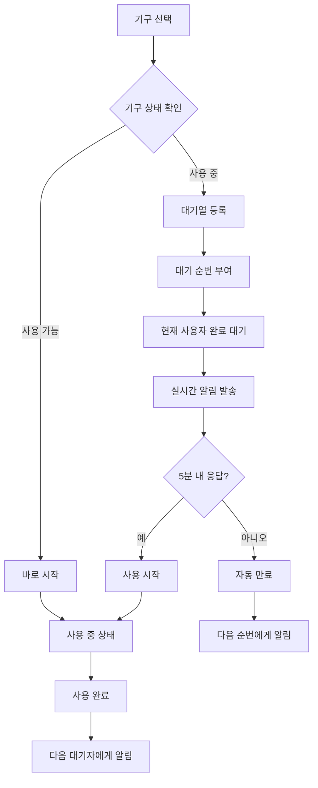

# 🏋️‍♂️ 헬스장 웨이팅 시스템 (Gym Waiting System)

> **실시간 기구 대기열 관리 시스템** - 줄서기 방식으로 공정하고 효율적인 헬스장 기구 사용

## 📖 개요

기존의 복잡한 시간 예약 시스템을 벗어나, **실제 헬스장 환경에 최적화된 대기열 시스템**입니다. 
기구가 사용 중일 때 대기 순번을 미리 확보하고, 기구가 비면 실시간 알림을 받아 5분 내에 사용을 시작하는 자연스러운 플로우를 제공합니다.

### ✨ 주요 특징

- 🔔 **실시간 알림 시스템** - WebSocket 기반 즉시 알림
- ⏰ **5분 유예시간** - 공정한 기회 제공 및 자동 순번 이동
- 📱 **직관적인 UI** - 현재 상태 한눈에 파악
- 🔄 **자동 대기열 관리** - 취소/만료 시 자동 순번 재배치
- 🌐 **크로스 플랫폼** - 웹/모바일 반응형 지원
- 📊 **실시간 모니터링** - 관리자 대시보드

## 🛠 기술 스택

### Backend
- **Node.js** + **Express.js** - REST API 서버
- **WebSocket (ws)** - 실시간 통신
- **Prisma ORM** - 데이터베이스 관리
- **PostgreSQL** - 데이터베이스
- **Passport.js** - Google OAuth 인증
- **JWT** - 토큰 기반 인증


## 🏗 시스템 아키텍처

```
┌─────────────────┐    ┌─────────────────┐    ┌─────────────────┐
│                 │    │                 │    │                 │
│   React Client  │◄──►│  Express Server │◄──►│   PostgreSQL    │
│                 │    │                 │    │                 │
└─────────────────┘    └─────────────────┘    └─────────────────┘
         ▲                        ▲
         │                        │
         ▼                        ▼
┌─────────────────┐    ┌─────────────────┐
│   WebSocket     │    │   Google OAuth  │
│   (실시간 알림)   │    │   (인증)        │
└─────────────────┘    └─────────────────┘
```

## 📊 데이터베이스 스키마

### 핵심 테이블

#### 1. EquipmentUsage (기구 사용 현황)
```sql
- id: 고유 ID
- equipmentId: 기구 ID (FK)
- userId: 사용자 ID (FK)  
- startedAt: 사용 시작 시간
- endedAt: 사용 종료 시간
- sets: 세트 수
- restMinutes: 휴식 시간
- status: 상태 (IN_USE, COMPLETED)
```

#### 2. WaitingQueue (대기열)```sql  
- id: 고유 ID
- equipmentId: 기구 ID (FK)
- userId: 사용자 ID (FK)
- queuePosition: 대기 순번
- status: 상태 (WAITING, NOTIFIED, COMPLETED, CANCELLED, EXPIRED)
- createdAt: 등록 시간
- notifiedAt: 알림 시간
```

## 🚀 설치 및 실행

### 1. 저장소 클론
```bash
git clone https://github.com/your-username/gym-waiting-system.git
cd gym-waiting-system
```

### 2. 의존성 설치
```bash
# 백엔드 의존성
npm install

# WebSocket 추가 설치
npm install ws


### 3.데이터베이스 설정
```bash
# Prisma 초기화 (이미 되어있다면 스킵)
npx prisma generate


### 5. 서버 실행
npm run dev


### 6. 접속 확인
- **API 서버**: http://localhost:4000
- **WebSocket**: ws://localhost:4000/ws  

## 📱 사용 방법

### 1. 회원가입 및 로그인
- Google 계정으로 간편 로그인
- 최초 로그인 시 자동 회원가입

### 2. 기구 둘러보기
- 카테고리별 기구 목록 확인
- 실시간 사용 현황 확인
- 대기열 정보 확인

### 3. 기구 사용 시작
**Case 1: 기구가 비어있을 때**
```
기구 선택 → "바로 시작" 버튼 → 사용 중 상태
```

**Case 2: 기구가 사용 중일 때**  
```
기구 선택 → "대기열 등록" → 순번 대기 → 알림 받기 → "시작" 버튼 (5분 내)
```

### 4. 기구 사용 완료
```
"사용 완료" 버튼 → 다음 대기자에게 자동 알림
```

## 🔄 핵심 플로우

### 웨이팅 시스템 동작 과정



## 🎯 API 엔드포인트

### 인증 관련
```http
GET    /api/auth/google              # Google OAuth 로그인
GET    /api/auth/google/callback     # OAuth 콜백
POST   /api/auth/logout              # 로그아웃
GET    /api/auth/me                  # 현재 사용자 정보
```

### 기구 관련
```http
GET    /api/equipment                # 기구 목록 조회
GET    /api/equipment/categories     # 카테고리 목록
GET    /api/equipment/:id            # 기구 상세 정보
```

### 웨이팅 시스템
```http
POST   /api/waiting/start-using/:equipmentId    # 기구 사용 시작
POST   /api/waiting/finish-using/:equipmentId   # 기구 사용 완료
POST   /api/waiting/queue/:equipmentId          # 대기열 등록
DELETE /api/waiting/queue/:queueId              # 대기열 취소
GET    /api/waiting/status/:equipmentId         # 기구 상태 조회
GET    /api/waiting/my-queues                   # 내 대기열 현황
```

### 즐겨찾기
```http
GET    /api/favorites                # 즐겨찾기 목록
POST   /api/favorites                # 즐겨찾기 추가  
DELETE /api/favorites/equipment/:id  # 즐겨찾기 제거
```

## 🔔 실시간 알림 시스템

### WebSocket 연결
```javascript
// 클라이언트 연결
const ws = new WebSocket('ws://localhost:4000/ws')

// 인증
ws.send(JSON.stringify({
  type: 'auth', 
  token: 'your-jwt-token'
}))

// 알림 수신
ws.onmessage = (event) => {
  const data = JSON.parse(event.data)
  if (data.type === 'EQUIPMENT_AVAILABLE') {
    // 기구 사용 가능 알림 처리
    showNotification(data.message)
  }
}
```

### 알림 타입
- **EQUIPMENT_AVAILABLE**: 기구 사용 가능 (5분 유예시간 시작)
- **QUEUE_EXPIRED**: 시간 초과로 대기열에서 제거
- **auth_success**: WebSocket 인증 성공

## 👨‍💼 관리자 기능

### 실시간 대시보드
- 전체 기구 사용 현황 모니터링
- 대기열 실시간 현황
- 사용 통계 및 인사이트
- 강제 사용 완료 기능 (긴급 상황 시)

### 접근 방법
```
/admin 경로로 접속 (관리자 권한 필요)
```


### 웨이팅 시스템 시나리오 테스트

1. **기본 플로우 테스트**
   - 두 개의 브라우저 탭으로 서로 다른 계정 로그인
   - 첫 번째 계정에서 기구 사용 시작
   - 두 번째 계정에서 대기열 등록
   - 첫 번째 계정에서 사용 완료
   - 두 번째 계정에서 실시간 알림 확인

2. **타임아웃 테스트**
   - 대기열 등록 후 알림 받기
   - 5분 대기 후 자동 만료 확인
   - 다음 순번 자동 이동 확인

## 📈 성능 최적화

### 데이터베이스 최적화
- 복합 인덱스 설정: `(equipmentId, status)`
- 유니크 제약조건: 중복 사용/대기 방지
- 쿼리 최적화: 필요한 데이터만 조회

### WebSocket 최적화
- 연결 풀 관리
- 메모리 누수 방지
- 자동 재연결 로직

### 캐싱 전략
```javascript
// Redis 캐싱 (선택사항)
const redis = require('redis')
const client = redis.createClient()

// 기구 상태 캐싱 (30초)
await client.setEx(`equipment:${id}:status`, 30, JSON.stringify(status))
```


## 🔒 보안 고려사항

### 인증 및 인가
- JWT 토큰 기반 인증
- Google OAuth 2.0 보안 흐름
- 세션 관리 및 토큰 갱신

### 데이터 보호
```javascript
// 입력 데이터 검증
const { z } = require('zod')

const equipmentSchema = z.object({
  equipmentId: z.number().int().positive(),
  sets: z.number().int().min(1).max(20),
  restMinutes: z.number().int().min(1).max(10)
})
```

### WebSocket 보안
- 토큰 기반 WebSocket 인증
- CORS 설정
- Rate Limiting

## 📊 모니터링 및 로깅

### 로그 설정
```javascript
const winston = require('winston')

const logger = winston.createLogger({
  level: 'info',
  format: winston.format.json(),
  transports: [
    new winston.transports.File({ filename: 'error.log', level: 'error' }),
    new winston.transports.File({ filename: 'combined.log' })
  ]
})
```

### 주요 메트릭
- 동시 사용자 수
- 평균 대기 시간
- 기구별 사용 빈도
- 알림 전달 성공률

## 🤝 기여하기


### 코드 스타일
- ESLint + Prettier 설정 준수
- 커밋 메시지: [Conventional Commits](https://conventionalcommits.org/) 형식

