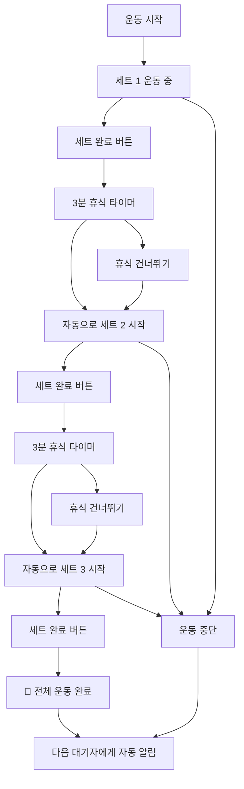

# 🏋️‍♂️ 헬스장 웨이팅 시스템 (Gym Waiting System)

> **실시간 기구 대기열 관리 시스템** - 줄서기 방식으로 공정하고 효율적인 헬스장 기구 사용

## 📖 개요

기존의 복잡한 **시간 예약 시스템**을 넘어선, 실제 헬스장 환경에 최적화된 **웨이팅(대기열) 시스템**입니다. 
시간을 미리 정하지 않고, 현장에서 **"줄서기"** 방식으로 순서를 기다린 후, **세트별 운동 진행을 실시간 추적**하여 자동으로 다음 사람에게 넘어가는 자연스러운 플로우를 제공합니다.

### 🎯 핵심 아이디어
- **❌ 시간 예약**: "오후 2시부터 3시까지 벤치프레스 예약"
- **✅ 웨이팅**: "벤치프레스 대기 → 알림 받기 → 3세트 운동 → 자동 완료"

## ✨ 주요 특징

### 🔔 **실시간 알림 시스템**
- WebSocket 기반 즉시 알림
- 브라우저 푸시 알림 + 진동(모바일)
- 5분 유예시간 자동 관리

### 🏋️ **세트별 운동 진행 추적**
- 1~20세트 자유 설정 (기본 3세트)
- 세트 완료 → 자동 휴식 타이머 → 다음 세트 시작
- 마지막 세트 완료 시 **자동으로 다음 사람에게**
- 실시간 진행률 표시 및 남은 휴식시간 카운트다운

### 📱 **직관적인 사용 경험**
- **시간 입력 불필요** - 대기열 등록만 하면 끝
- 현재 상태 한눈에 파악 (운동 중 vs 휴식 중)
- 유연한 제어 (휴식 건너뛰기, 운동 중단)
- 크로스 플랫폼 반응형 지원

### 🔄 **자동 대기열 관리**
- 공정한 FIFO(First In, First Out) 순서
- 취소/만료 시 자동 순번 재배치
- 실시간 대기 현황 모니터링


## 🛠 기술 스택

### Backend
- **Node.js** + **Express.js** - REST API 서버
- **WebSocket (ws)** - 실시간 통신
- **Prisma ORM** - 데이터베이스 관리
- **PostgreSQL** - 데이터베이스
- **Passport.js** - Google OAuth 인증
- **JWT** - 토큰 기반 인증

## 🏗 시스템 아키텍처

```
┌─────────────────┐    HTTP/WS     ┌─────────────────┐    Prisma    ┌─────────────────┐
│                 │◄──────────────►│                 │◄────────────►│                 │
│   React Client  │                │  Express Server │              │   PostgreSQL    │
│                 │                │   + WebSocket   │              │                 │
└─────────────────┘                └─────────────────┘              └─────────────────┘
         ▲                                    ▲
         │                                    │
         ▼                                    ▼
┌─────────────────┐                ┌─────────────────┐
│  Browser Push   │                │   Google OAuth  │
│  Notifications  │                │   Authentication │
└─────────────────┘                └─────────────────┘
```

## 📊 데이터베이스 스키마

### 핵심 테이블

#### 1. EquipmentUsage (기구 사용 현황)
```sql
- id: 고유 ID
- equipmentId: 기구 ID (FK)
- userId: 사용자 ID (FK)
- totalSets: 전체 세트 수 (1~20)
- currentSet: 현재 세트 (1부터 시작)
- restMinutes: 세트간 휴식 시간 (0~10분)
- status: 전체 상태 (IN_USE, COMPLETED)
- setStatus: 세트 상태 (EXERCISING, RESTING, COMPLETED, STOPPED)
- startedAt: 운동 시작 시간
- currentSetStartedAt: 현재 세트 시작 시간
- restStartedAt: 휴식 시작 시간
- endedAt: 운동 완료 시간
```

#### 2. WaitingQueue (대기열)
```sql
- id: 고유 ID
- equipmentId: 기구 ID (FK)
- userId: 사용자 ID (FK)
- queuePosition: 대기 순번 (1, 2, 3...)
- status: 대기 상태 (WAITING, NOTIFIED, COMPLETED, CANCELLED, EXPIRED)
- createdAt: 등록 시간
- notifiedAt: 알림 시간
```


### 3.데이터베이스 설정
```bash
# Prisma 초기화 (이미 되어있다면 스킵)
npx prisma generate


### 서버 실행
npm run dev

### 6. 접속 확인
서버 시작 시 다음과 같은 메시지가 출력됩니다:
```
🎉====================================🎉
🚀 API 서버: http://localhost:4000
🔌 WebSocket: ws://localhost:4000/ws
📱 실시간 알림: 활성화
🗄️  데이터베이스: 연결됨
🌍 환경: development
🎉====================================🎉
```
## 📱 사용 방법

### 1. 회원가입 및 로그인
- Google 계정으로 간편 로그인 (OAuth 2.0)
- 최초 로그인 시 자동 회원가입

### 2. 기구 둘러보기
- 카테고리별 기구 목록 (가슴, 등, 다리, 어깨, 팔, 유산소, 복근)
- 실시간 사용 현황 및 대기열 정보 확인

### 3. 웨이팅 시스템 사용하기

#### Case 1: 기구가 비어있을 때
```
1. 기구 선택
2. 운동 설정 (세트 수, 휴식 시간)
3. "바로 시작" 클릭
4. 세트별 운동 진행
5. 자동 완료 → 다음 대기자에게 알림
```

#### Case 2: 기구가 사용 중일 때
```
1. 기구 선택
2. "대기열 등록" 클릭 → 순번 받기
3. 대기 중 (실시간 순번 확인)
4. 알림 받기 "기구 사용 가능!" (5분 유예시간)
5. "운동 시작" 클릭
6. 세트별 운동 진행
7. 자동 완료 → 다음 대기자에게 알림
```

### 4. 세트별 운동 진행
- **세트 시작**: 자동으로 현재 세트 표시
- **세트 완료**: "세트 완료" 버튼 → 자동 휴식 시작
- **휴식 중**: 카운트다운 타이머 → 자동으로 다음 세트
- **휴식 건너뛰기**: "다음 세트 시작" 버튼으로 즉시 다음 세트
- **운동 중단**: "중단" 버튼으로 언제든 종료 가능

## 🔄 운동 플로우 상세

### 🎯 **세트별 진행 예시** (3세트, 3분 휴식)




## 🏋️ 헬스장 기구 예약 및 웨이팅 시스템 - Backend API 문서
1. [시스템 개요](#시스템-개요)
2. [인증 시스템](#인증-시스템)
3. [기구 관리 API](#기구-관리-api)
4. [예약 시스템 API](#예약-시스템-api)
5. [즐겨찾기 API](#즐겨찾기-api)
6. [웨이팅 시스템 API](#웨이팅-시스템-api)
7. [실시간 알림 (WebSocket)](#실시간-알림-websocket)
8. [데이터 모델](#데이터-모델)
9. [환경 설정](#환경-설정)

## 🎯 시스템 개요

이 시스템은 헬스장의 기구 사용을 효율적으로 관리하기 위한 백엔드 API입니다. 주요 기능은 다음과 같습니다:

- **Google OAuth 인증**: 간편한 소셜 로그인
- **기구 관리**: 카테고리별 헬스장 기구 조회
- **예약 시스템**: 시간 기반 기구 예약
- **웨이팅 시스템**: 실시간 대기열 관리 및 세트별 운동 추적
- **즐겨찾기**: 자주 사용하는 기구 저장
- **실시간 알림**: WebSocket을 통한 즉시 알림

## 🔐 인증 시스템

### 1. Google OAuth 로그인

#### 로그인 시작
```http
GET /api/auth/google
```
- 사용자를 Google OAuth 페이지로 리다이렉트

#### 로그인 콜백 (자동 처리됨)
```http
GET /api/auth/google/callback
```
- Google에서 콜백 후 프론트엔드로 리다이렉트
- 성공: `${FRONTEND_URL}/oauth-success?token=JWT_TOKEN&user=USER_INFO`
- 실패: `${FRONTEND_URL}/?error=auth_failed`

#### 현재 사용자 정보 조회
```http
GET /api/auth/me
Authorization: Bearer {JWT_TOKEN}
```

**응답 예시:**
```json
{
  "id": 1,
  "email": "user@example.com",
  "name": "홍길동",
  "avatar": "https://lh3.googleusercontent.com/...",
  "createdAt": "2025-01-01T00:00:00.000Z"
}
```

#### 로그아웃
```http
POST /api/auth/logout
```

## 🏋️ 기구 관리 API

### 1. 기구 목록 조회
```http
GET /api/equipment?category=가슴&search=벤치
Authorization: Bearer {JWT_TOKEN} (선택사항)
```

**쿼리 파라미터:**
- `category` (선택): 카테고리 필터 (`가슴`, `등`, `다리`, `어깨`, `팔`, `유산소`)
- `search` (선택): 기구명/근육그룹 검색

**응답 예시:**
```json
[
  {
    "id": 8,
    "name": "바벨 벤치 프레스",
    "imageUrl": null,
    "category": "가슴",
    "muscleGroup": "대흉근, 삼두, 어깨",
    "createdAt": "2025-01-01T00:00:00.000Z",
    "reservationCount": 5,
    "isFavorite": true
  }
]
```

### 2. 카테고리 목록 조회
```http
GET /api/equipment/categories
```

**응답 예시:**
```json
[
  { "name": "가슴", "count": 3 },
  { "name": "등", "count": 4 },
  { "name": "다리", "count": 5 }
]
```

### 3. 특정 기구 상세 조회
```http
GET /api/equipment/{equipmentId}
Authorization: Bearer {JWT_TOKEN} (선택사항)
```

**응답 예시:**
```json
{
  "id": 8,
  "name": "바벨 벤치 프레스",
  "imageUrl": null,
  "category": "가슴",
  "muscleGroup": "대흉근, 삼두, 어깨",
  "createdAt": "2025-01-01T00:00:00.000Z",
  "reservations": [
    {
      "id": 1,
      "startAt": "2025-01-01T10:00:00.000Z",
      "endAt": "2025-01-01T10:30:00.000Z",
      "user": { "name": "홍길동" }
    }
  ],
  "isFavorite": false,
  "favoriteCount": 12
}
```

## 📅 예약 시스템 API

### 1. 예약 생성
```http
POST /api/reservations
Authorization: Bearer {JWT_TOKEN}
Content-Type: application/json
```

**요청 바디:**
```json
{
  "equipmentId": 1,
  "startAt": "2025-01-01T10:00:00.000Z",
  "endAt": "2025-01-01T10:30:00.000Z",
  "sets": 3,
  "restMinutes": 2
}
```

**응답 예시:**
```json
{
  "id": 1,
  "equipmentId": 1,
  "userId": 1,
  "startAt": "2025-01-01T10:00:00.000Z",
  "endAt": "2025-01-01T10:30:00.000Z",
  "sets": 3,
  "restMinutes": 2,
  "status": "BOOKED",
  "equipment": {
    "id": 1,
    "name": "바벨 벤치 프레스"
  }
}
```

### 2. 내 예약 목록 조회
```http
GET /api/reservations/me
Authorization: Bearer {JWT_TOKEN}
```

### 3. 예약 가능 시간 확인
```http
GET /api/reservations/availability?equipmentId=1&date=2025-01-01&open=09:00&close=18:00&slotMinutes=30
```

**응답 예시:**
```json
{
  "equipmentId": 1,
  "date": "2025-01-01",
  "slotMinutes": 30,
  "slots": [
    {
      "startAt": "2025-01-01T09:00:00.000Z",
      "endAt": "2025-01-01T09:30:00.000Z"
    }
  ],
  "existingReservations": [
    {
      "id": 1,
      "startAt": "2025-01-01T10:00:00.000Z",
      "endAt": "2025-01-01T10:30:00.000Z",
      "userName": "홍길동"
    }
  ]
}
```

### 4. 예약 수정/삭제
```http
PUT /api/reservations/{reservationId}
DELETE /api/reservations/{reservationId}
Authorization: Bearer {JWT_TOKEN}
```

## ⭐ 즐겨찾기 API

### 1. 내 즐겨찾기 목록
```http
GET /api/favorites
Authorization: Bearer {JWT_TOKEN}
```

### 2. 즐겨찾기 추가
```http
POST /api/favorites
Authorization: Bearer {JWT_TOKEN}
Content-Type: application/json
```

**요청 바디:**
```json
{
  "equipmentId": 1
}
```

### 3. 즐겨찾기 제거
```http
DELETE /api/favorites/equipment/{equipmentId}
Authorization: Bearer {JWT_TOKEN}
```

### 4. 즐겨찾기 상태 확인
```http
GET /api/favorites/check/{equipmentId}
Authorization: Bearer {JWT_TOKEN}
```

**응답 예시:**
```json
{
  "isFavorite": true
}
```

## 🚶‍♂️ 웨이팅 시스템 API

웨이팅 시스템은 실시간으로 기구 사용 현황을 추적하고 대기열을 관리합니다.

### 🏃‍♂️ 운동 관리 API

#### 1. 기구 사용 시작
```http
POST /api/waiting/start-using/{equipmentId}
Authorization: Bearer {JWT_TOKEN}
Content-Type: application/json
```

**요청 바디:**
```json
{
  "totalSets": 3,
  "restMinutes": 2
}
```

**응답 예시:**
```json
{
  "id": 1,
  "equipmentId": 1,
  "equipmentName": "바벨 벤치 프레스",
  "totalSets": 3,
  "currentSet": 1,
  "setStatus": "EXERCISING",
  "restMinutes": 2,
  "startedAt": "2025-01-01T10:00:00.000Z",
  "currentSetStartedAt": "2025-01-01T10:00:00.000Z",
  "estimatedEndAt": "2025-01-01T10:15:00.000Z",
  "progress": 33
}
```

#### 2. 세트 완료
```http
POST /api/waiting/complete-set/{equipmentId}
Authorization: Bearer {JWT_TOKEN}
```

**응답 예시:**
```json
{
  "message": "1/3 세트 완료",
  "setStatus": "RESTING"
}
```

#### 3. 휴식 스킵 (다음 세트 바로 시작)
```http
POST /api/waiting/skip-rest/{equipmentId}
Authorization: Bearer {JWT_TOKEN}
```

#### 4. 운동 중단
```http
POST /api/waiting/stop-exercise/{equipmentId}
Authorization: Bearer {JWT_TOKEN}
```

#### 5. 운동 상태 조회
```http
GET /api/waiting/exercise-status/{equipmentId}
Authorization: Bearer {JWT_TOKEN}
```

**응답 예시:**
```json
{
  "equipmentId": 1,
  "equipmentName": "바벨 벤치 프레스",
  "totalSets": 3,
  "currentSet": 2,
  "setStatus": "RESTING",
  "restMinutes": 2,
  "restTimeLeftSec": 45,
  "currentSetElapsedSec": 180,
  "etaMinutes": 8,
  "progress": 67
}
```

### 📝 대기열 관리 API

#### 1. 대기열 등록
```http
POST /api/waiting/queue/{equipmentId}
Authorization: Bearer {JWT_TOKEN}
```

**응답 예시:**
```json
{
  "id": 1,
  "queuePosition": 2,
  "equipmentId": 1,
  "equipmentName": "바벨 벤치 프레스",
  "status": "WAITING"
}
```

#### 2. 대기 취소
```http
DELETE /api/waiting/queue/{queueId}
Authorization: Bearer {JWT_TOKEN}
```

#### 3. 기구 상태 조회 (현재 사용자 + 대기열)
```http
GET /api/waiting/status/{equipmentId}
```

**응답 예시:**
```json
{
  "equipmentId": 1,
  "equipmentName": "바벨 벤치 프레스",
  "isAvailable": false,
  "currentUser": {
    "name": "홍길동",
    "startedAt": "2025-01-01T10:00:00.000Z",
    "totalSets": 3,
    "currentSet": 2,
    "setStatus": "EXERCISING",
    "restMinutes": 2,
    "progress": 67,
    "estimatedEndAt": "2025-01-01T10:15:00.000Z",
    "estimatedWaitMinutes": 5
  },
  "waitingQueue": [
    {
      "id": 1,
      "position": 1,
      "userName": "김철수",
      "status": "WAITING",
      "createdAt": "2025-01-01T10:05:00.000Z",
      "estimatedWaitMinutes": 10
    }
  ],
  "totalWaiting": 1,
  "averageWaitTime": 10
}
```

### 🔧 관리자 기능

#### 1. 대기열 재정렬
```http
POST /api/waiting/reorder/{equipmentId}
Authorization: Bearer {JWT_TOKEN}
```

#### 2. 강제 완료 (관리자)
```http
POST /api/waiting/force-complete/{equipmentId}
Authorization: Bearer {JWT_TOKEN}
```

#### 3. 통계 조회
```http
GET /api/waiting/stats
Authorization: Bearer {JWT_TOKEN}
```

**응답 예시:**
```json
{
  "today": {
    "totalSessions": 45,
    "averageSets": 3
  },
  "week": {
    "totalSessions": 312
  },
  "current": {
    "activeUsers": 5,
    "waitingUsers": 8,
    "totalUsers": 13
  },
  "popularEquipment": [
    {
      "equipmentId": 1,
      "equipmentName": "바벨 벤치 프레스",
      "usageCount": 23
    }
  ]
}
```

## 🔔 실시간 알림 (WebSocket)

### 연결 설정
```javascript
const ws = new WebSocket('wss://your-backend.com/ws');

ws.onopen = () => {
  // JWT 토큰으로 인증
  ws.send(JSON.stringify({
    type: 'auth',
    token: 'your-jwt-token'
  }));
};

ws.onmessage = (event) => {
  const data = JSON.parse(event.data);
  console.log('받은 알림:', data);
};
```

### 알림 타입들

#### 1. 인증 성공
```json
{
  "type": "auth_success",
  "message": "실시간 알림 연결 완료"
}
```

#### 2. 기구 사용 가능 알림
```json
{
  "type": "EQUIPMENT_AVAILABLE",
  "title": "기구 사용 가능",
  "message": "바벨 벤치 프레스을 사용할 차례입니다. 5분 내 시작해주세요",
  "equipmentId": 1,
  "equipmentName": "바벨 벤치 프레스",
  "queueId": 1,
  "graceMinutes": 5
}
```

#### 3. 휴식 시작 알림
```json
{
  "type": "REST_STARTED",
  "title": "휴식 시작",
  "message": "1/3 세트 완료. 2분 휴식",
  "equipmentId": 1
}
```

#### 4. 다음 세트 시작 알림
```json
{
  "type": "NEXT_SET_STARTED",
  "title": "다음 세트",
  "message": "2/3 세트 시작",
  "equipmentId": 1
}
```

#### 5. 대기 만료 알림
```json
{
  "type": "QUEUE_EXPIRED",
  "title": "대기 만료",
  "message": "시간 초과로 대기에서 제외되었습니다",
  "equipmentId": 1
}
```

## 📊 데이터 모델

### User (사용자)
```typescript
interface User {
  id: number;
  email: string;
  name: string;
  googleId: string;
  avatar?: string;
  createdAt: Date;
}
```

### Equipment (기구)
```typescript
interface Equipment {
  id: number;
  name: string;
  imageUrl?: string;
  category: string;  // '가슴', '등', '다리', '어깨', '팔', '유산소'
  muscleGroup?: string;
  createdAt: Date;
}
```

### EquipmentUsage (현재 사용 상태)
```typescript
interface EquipmentUsage {
  id: number;
  equipmentId: number;
  userId: number;
  startedAt: Date;
  endedAt?: Date;
  estimatedEndAt?: Date;
  totalSets: number;
  restMinutes: number;
  status: 'IN_USE' | 'COMPLETED';
  currentSet: number;
  setStatus: 'EXERCISING' | 'RESTING' | 'COMPLETED' | 'STOPPED' | 'FORCE_COMPLETED';
  currentSetStartedAt?: Date;
  restStartedAt?: Date;
  createdAt: Date;
}
```

### WaitingQueue (대기열)
```typescript
interface WaitingQueue {
  id: number;
  equipmentId: number;
  userId: number;
  queuePosition: number;
  status: 'WAITING' | 'NOTIFIED' | 'COMPLETED' | 'CANCELLED' | 'EXPIRED';
  createdAt: Date;
  notifiedAt?: Date;
  updatedAt: Date;
}
```

### Reservation (예약)
```typescript
interface Reservation {
  id: number;
  userId: number;
  equipmentId: number;
  startAt: Date;
  endAt: Date;
  sets: number;
  restMinutes: number;
  status: string;
}
```

## ⚙️ 환경 설정

### 필수 환경 변수
```env
# 데이터베이스
DATABASE_URL="postgresql://..."
DIRECT_URL="postgresql://..."

# JWT
JWT_SECRET="your-jwt-secret"

# 세션
SESSION_SECRET="your-session-secret"

# Google OAuth
GOOGLE_CLIENT_ID="your-google-client-id"
GOOGLE_CLIENT_SECRET="your-google-client-secret"
GOOGLE_REDIRECT_URI="https://your-backend.com/api/auth/google/callback"

# 프론트엔드 URL
FRONTEND_URL="https://your-frontend.com"

# CORS 설정
CORS_ORIGINS="https://your-frontend.com,http://localhost:3000"
CORS_ORIGINS_REGEX="^https:\\/\\/.*\\.vercel\\.app$"
CORS_DEBUG="0"

# 서버
PORT="4000"
NODE_ENV="production"
```

## 🚨 에러 처리

모든 API는 다음 형식의 에러 응답을 반환합니다:

```json
{
  "error": "에러 메시지",
  "details": "상세 정보 (선택사항)"
}
```

### 주요 HTTP 상태 코드
- `200`: 성공
- `201`: 생성 성공
- `204`: 삭제 성공 (응답 바디 없음)
- `400`: 잘못된 요청 (입력 형식 오류)
- `401`: 인증 필요
- `403`: 권한 없음
- `404`: 리소스 없음
- `409`: 충돌 (중복 예약, 이미 사용 중 등)
- `500`: 서버 오류

## 💡 사용 팁

1. **토큰 관리**: JWT 토큰은 localStorage에 저장하고, 모든 인증이 필요한 API 호출 시 `Authorization: Bearer {token}` 헤더에 포함

2. **실시간 업데이트**: 웨이팅 시스템 관련 화면에서는 WebSocket 연결을 유지하여 실시간 알림 수신

3. **에러 처리**: 409 에러의 경우 사용자에게 명확한 안내 메시지 표시 (이미 사용 중, 대기 중 등)

4. **상태 폴링**: WebSocket이 연결되지 않은 상황에서는 `/api/waiting/status/{equipmentId}` 엔드포인트를 주기적으로 호출

5. **기구 상태 표시**: 각 기구의 현재 상태(사용 가능, 사용 중, 대기 인원)를 명확히 표시

이 API 문서를 참조하여 헬스장 기구 관리 시스템의 프론트엔드를 구현하실 수 있습니다. 추가 질문이 있으시면 언제든 문의해주세요!
